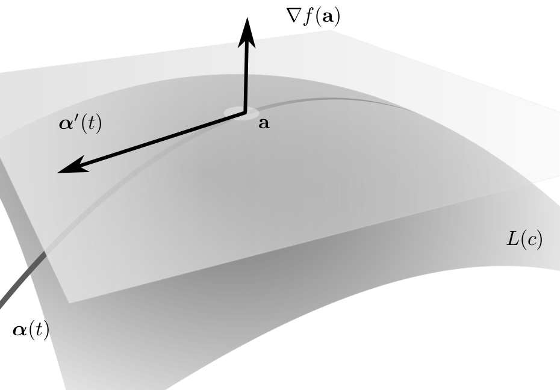

<!--@include: ./pages/notation.md-->

# Differential calculus in higher dimension

In this part of the course we work on the following skills:

- Become comfortable working with coordinates in arbitrary dimension.
- Develop an intuition for working with vector fields.
- Understand the subtleties of derivatives in dimension greater than 1, evaluate and manipulate partial derivatives, directional derivatives, Jacobian.

See also the [additional exercises](/pages/exercises2) associated to this part of the course.

Here we start to consider higher dimensional space.
That is, instead of $\mathbb{R}$ we consider $\mathbb{R}^n$ for $n\in \mathbb{N}$.
We will particularly focus on 2D and 3D but everything also holds in any dimension.
Going beyond $\mathbb{R}$ we have more options for functions and correspondingly more options for derivatives. Various different notation is commonly used. Here we will primarily use $(x,y)\in \mathbb{R}^2$, $(x,y,z) \in \mathbb{R}^3$ or, more generally, $\mathbf{x} =(x_1,x_2,\ldots,x_n) \in \mathbb{R}^n$ where $x_1 \in \mathbb{R},\ldots, x_n \in \mathbb{R}$. For example, $\mathbb{R}^2$ is the plane, $\mathbb{R}^3$ is 3D space.

::: tip Definition (inner product)

$$
\mathbf{x} \cdot \mathbf{y} = \sum_{k=1}^{n} x_k y_k \in \mathbb{R}
$$

:::

We recall that the inner product being zero has a geometric meaning, it means that the two vectors are orthogonal.
We also recall that the "length" of a vector is given by the norm, defined as follows.

::: tip Definition (norm)
$\norm{\mathbf{x}} =  \sqrt{\mathbf{x} \cdot \mathbf{x}} = {(\sum_{k=1}^{n} x_k^2 )}^{\frac{1}{2}}$.
:::

For example, in $\mathbb{R}^2$ then $\norm{(x,y)} = \sqrt{x^2 + y^2}$.
There are various convenient properties for working with norms and inner products, in particular, the [Cauchy-Schwarz inequality](https://en.wikipedia.org/wiki/Cauchy%E2%80%93Schwarz_inequality) $\abs{x\cdot y} \leq \norm{\mathbf{x}} \ \norm{\mathbf{y}}$ and the [triangle inequality](https://en.wikipedia.org/wiki/Triangle_inequality) $\norm{\mathbf{x} + \mathbf{y}} \leq \norm{\mathbf{x}} + \norm{\mathbf{y}}$.

The primary higher-dimensional functions we consider in this course are:

- Scalar fields:
  $f:\mathbb{R}^n \to \mathbb{R}$
- Vector fields:
  $\FF:\mathbb{R}^n \to \mathbb{R}^n$
- Paths:
  $\boldsymbol{\alpha}:\mathbb{R} \to \mathbb{R}^n$
- Change of coordinates:
  $\mathbf{x}:\mathbb{R}^n \to \mathbb{R}^n$

These possibilities all fit into the general pattern of $f:\mathbb{R}^n \to \mathbb{R}^m$ for $n,m\in \mathbb{N}$ but tradition and use of the function gives us different terminology and symbols.
Such functions are useful for representing various practical things, for example:
gravitational force; temperature in a region; wind velocity; fluid flow; electric field; etc.

## Open sets, closed sets, boundary, continuity

Let $\mathbf{a} \in \mathbb{R}^n$, $r>0$.
The open $n$-ball of radius $r$ and centre $\mathbf{a}$ is written as

$$
B(\mathbf{a},r):= \left\{ \mathbf{x} \in \mathbb{R}^n : \norm{\mathbf{x} - \mathbf{a}}< r \right\}.
$$

::: tip Definition (interior point)
Let $S \subset \mathbb{R}^n$.
A point $\mathbf{a} \in S$ is said to be an _interior point_ if there is $r>0$ such that $B(\mathbf{a},r) \subset S$.
The set of all interior points of $S$ is denoted $\operatorname{int} S$.
:::

::: tip Definition (open set)
A set $S \subset \mathbb{R}^n$ is said to be _open_ if all of its points are interior points, i.e., if $\operatorname{int} S = S$.
:::

For example, open intervals, open disks, open balls, unions of open intervals, etc., are all open sets.

::: info Lemma
Let $r>0$, $\mathbf{a} \in \mathbb{R}^n$. The set $B(\mathbf{a},r) \subset \mathbb{R}^n$ is open.
:::

::: info Proof
Let $\mathbf{b} \in B(\mathbf{a},r)$. It suffices to show that $\mathbf{b}$ is an interior point.
(1) Let $r_1 = \| \mathbf{b} - \mathbf{a} \| < r$.
(2) Let $r_2 = (r - r_1)/2$.
(3) We claim that $B(\mathbf{b},r_2) \subset B(\mathbf{a},r)$:
In order to see this take any $\mathbf{c} \in B(\mathbf{b},r_2)$ and observe that

$$
    \| \mathbf{c} - \mathbf{a} \| \leq \| \mathbf{c} - \mathbf{b} \|  + \| \mathbf{b} - \mathbf{a} \| \leq r_2 + r_1 = \frac{r + r_1}{2} < r.
$$

Observe that the radius of the ball will be small for points close to the boundary.
:::

::: tip Definition (Cartesian product)
If $A_1 \subset \mathbb{R}$, $A_2 \subset \mathbb{R}$ then the _Cartesian product_ is defined as

$$
    A_1 \times A_2 := \left\{(x,y): x \in A_1, y \in A_2\right\}
    \subset \mathbb{R}^{2}.
$$

:::

Analogously the Cartesian product can be defined in higher dimensions:
If $A_1 \subset \mathbb{R}^m$, $A_2 \subset \mathbb{R}^n$ then the _Cartesian product_ $A_1 \times A_2$ is defined as the set of all points $(x_1,\ldots,x_m,y_1,\ldots,y_n) \in \mathbb{R}^{m+n}$ such that $(x_1,\ldots,x_m) \in A_1$ and $(y_1,\ldots,y_n) \in A_2$.

::: info Lemma
If $A_1, A_2$ are open subsets of $\mathbb{R}$ then $A_1 \times A_2$ is an open subset of $\mathbb{R}^2$.
:::

::: info Proof
Let $\mathbf{a} = (a_1,a_2) \in A_1\times A_2 \subset \mathbb{R}^2$.
Since $A_1$ is open there exists $r_1>0$ such that $B(a_1,r_1)\subset A_1$.
Similarly for $A_2$.
Let $r=\min \{r_1,r_2\}$.
This all means that $B(\mathbf{a},r) \subset B(a_1,r_1) \times B(a_2,r_2) \subset A_1\times A_2$.
:::

Discussing the "interior" of the set naturally suggests the topic of the "boundary" of the set.
In the following definitions we develop this idea.

::: tip Definition (exterior points)
Let $S\subset \mathbb{R}^n$.
A point $\mathbf{a} \notin S$ is said to be an _exterior point_ if there exists $r>0$ such that $B(\mathbf{a},r)\cap S = \emptyset$.
The set of all exterior points of $S$ is denoted $\operatorname{ext} S$.
:::

Observe that $\operatorname{ext} S$ is an open set.
We use the notation $S^c = \mathbb{R}^n \setminus S$ and we say that $C^c$ is the _complement_ of the set $S$.

::: tip Definition (boundary)
The set $\mathbb{R}^n \setminus (\operatorname{int} S \cup \operatorname{ext} S )$ is called the boundary of $S \subset \mathbb{R}^n$ and is denoted $\partial S$.
:::

::: tip Definition (closed)
A set $S\subset \mathbb{R}^n$ is said to be _closed_ if $\partial S \subset S$.
:::

::: info Lemma
$S$ is open $\Longleftrightarrow$ $S^c$ is closed.
:::
::: info Proof
Observe that $\mathbb{R}^n =  \operatorname{int} S \cup \partial S \cup \operatorname{ext} S$ (disjointly).
If $\mathbf{x} \in \partial S$ then, for every $r>0$, $B(\mathbf{x},r) \cap S \neq \emptyset$ and so $\mathbf{x} \in \partial(S^c)$.
Similarly with $S$ and $S^c$ swapped and so $\partial S = \partial(S^c)$.
If $S$ is open then $\operatorname{int} S = S$ and $S^c = \operatorname{ext} S \cup \partial S =  \operatorname{ext} S \cup \partial (S^c)$ and so $S^c$ is closed.
If $S$ is not open then there exists $\mathbf{a} \in \partial S \cap S$. Additionally $\mathbf{a} \in \partial (S^c) \cap S$ hence $S^c$ is not closed.
:::

## Limits and continuity

Let $S\subset \mathbb{R}^n$ and $\ff : S \to \mathbb{R}^m$.
If $\mathbf{a}\in \mathbb{R}^n$, $\mathbf{b}\in \mathbb{R}^m$ we write
$\lim_{\mathbf{x} \to \mathbf{a}}\ff(\mathbf{x}) = \mathbf{b}$
to mean that
$\norm{\ff(\mathbf{x})-\mathbf{b}} \to 0$ as $\norm{\mathbf{x}-\mathbf{a}}\to 0$.
Observe how, if $n=m=1$, this is the familiar notion of continuity for functions on $\mathbb{R}$.

::: tip Definition (Continuous)
A function $\ff$ is said to be _continuous_ at $\mathbf{a}$ if $\ff$ is defined at $\mathbf{a}$ and
$\lim_{\mathbf{x} \to \mathbf{a}}\ff(\mathbf{x}) = \ff(\mathbf{a})$.
We say $\ff$ is continuous on $S$ if $\ff$ is continuous at each point of $S$.
:::

Even functions which look "nice" can fail to be continuous as we can see in the following example.

::: info Example (continuity in higher dimensions)
Let $f$ be defined, for $(x,y)\neq (0,0)$, as

$$
    f(x,y) = \frac{x y}{x^2 + y^2}
$$

and $f(0,0)=0$.
What is the behaviour of $f$ when approaching $(0,0)$ along the following lines?

| line       | value                  |
| ---------- | ---------------------- |
| $\{x=0\}$  | $f(0,t) =  0$          |
| $\{y=0\}$  | $f(t,0) = 0$           |
| $\{x=y\}$  | $f(t,t) = \frac{1}{2}$ |
| $\{x=-y\}$ | $f(t,t) =-\frac{1}{2}$ |

:::

::: theorem
Suppose that $\lim_{\mathbf{x} \to \mathbf{a}}\ff(\mathbf{x}) = \mathbf{b}$ and $\lim_{\mathbf{x} \to \mathbf{a}}\mathbf{g}(\mathbf{x}) = \mathbf{c}$.
Then

1.  $\lim_{\mathbf{x} \to \mathbf{a}}(\ff(\mathbf{x})+\mathbf{g}(\mathbf{x})) = \mathbf{b}+\mathbf{c}$,
2.  $\lim_{\mathbf{x} \to \mathbf{a}} \lambda \ff(\mathbf{x}) = \lambda \mathbf{b}$ for every $\lambda \in \mathbb{R}$,
3.  $\lim_{\mathbf{x} \to \mathbf{a}}\ff(\mathbf{x})\cdot \mathbf{g}(\mathbf{x}) = \mathbf{b}\cdot \mathbf{c}$,
4.  $\lim_{\mathbf{x} \to \mathbf{a}} \norm{\ff(\mathbf{x})} = \norm{\mathbf{b}}$.

:::

We prove a couple of the parts of the above theorem here, the other parts are left as exercises.

::: info Proof of part 3.

Observe that $\ff(\mathbf{x})\cdot\mathbf{g}(\mathbf{x}) - \mathbf{b}\cdot \mathbf{c}
= (\ff(\mathbf{x})-\mathbf{b})\cdot(\mathbf{g}(\mathbf{x})-\mathbf{c}) + \mathbf{b}\cdot(\mathbf{g}(\mathbf{x})-\mathbf{c}) + \mathbf{c}\cdot(\ff(\mathbf{x})-\mathbf{b})$.
By the triangle inequality and Cauchy-Schwarz,

$$
    \begin{aligned}
        \norm{\ff(\mathbf{x})\cdot\mathbf{g}(\mathbf{x}) - \mathbf{b}\cdot \mathbf{c} }
            & \leq \norm{\ff(\mathbf{x})-\mathbf{b}} \norm{\mathbf{g}(\mathbf{x})-\mathbf{c}} \\
            & \quad + \norm{\mathbf{b}}\norm{\mathbf{g}(\mathbf{x})-\mathbf{c}}        \\
            & \quad + \norm{\mathbf{c}} \norm{\ff(\mathbf{x})-\mathbf{b}}.
    \end{aligned}
$$

Since we already know that $\norm{\ff(\mathbf{x})-\mathbf{b}} \to 0$ and $\norm{\mathbf{g}(\mathbf{x})-\mathbf{c}} \to 0$ as $\mathbf{x} \to \mathbf{a}$, this implies that $\norm{\ff(\mathbf{x})\cdot\mathbf{g}(\mathbf{x}) - \mathbf{b}\cdot \mathbf{c} }\to 0$.
:::

::: info Proof of part 4.
Take $\ff = \mathbf{g}$ in part (c) implies that $\lim_{\mathbf{x} \to \mathbf{a}} \norm{\ff(\mathbf{x})}^2 = \norm{\mathbf{b}}^2$.
:::

When writing a vector field (or similar functions) it is often convenient to divide the higher-dimensional function into smaller parts.
We call these parts the _components of a vector field_.
For example $\FF(\mathbf{x}) = \left(F_1(\mathbf{x}),F_2(\mathbf{x})\right)$ in 2D, $\FF(\mathbf{x}) = \left(F_1(\mathbf{x}),F_2(\mathbf{x}),F_3(\mathbf{x})\right)$ in 3D, etc.

::: theorem
Let $\FF(\mathbf{x}) = \left(F_1(\mathbf{x}),F_2(\mathbf{x})\right)$.
Then $\FF$ is continuous if and only if $F_1$ and $F_2$ are continuous.
:::

::: info Proof
We will independently prove the two implications.

- ($\Rightarrow$)
  Let
  $\mathbf{e}_1=(1,0)$, $\mathbf{e}_2=(0,1)$
  and observe that $F_k(\mathbf{x}) = \FF(\mathbf{x})\cdot \mathbf{e}_k$.
  We have already shown that the continuity of two vector fields implies the continuity of the inner product.
- ($\Leftarrow$)
  By definition of the norm
  $$
    \norm{\FF(\mathbf{x})-\FF(\mathbf{a})}^2 = \sum_{k=1}^{2}{(F_k(\mathbf{x})-F_k(\mathbf{a}))}^2
  $$
  and we know $\norm{F_k(\mathbf{x})-F_k(\mathbf{a})} \to 0$ as $\norm{\mathbf{x}-\mathbf{a}}\to 0$.
  :::

In higher dimensions the analogous statement is true for the vector field $\FF(\mathbf{x}) = \left(F_1(\mathbf{x}),\ldots,F_m(\mathbf{x}) \right)$ with exactly the same proof.
I.e., $\FF$ is continuous if and only if each $f_k$ is continuous.

::: info Example (polynomials)
A _polynomial_ in $n$ variables is a scalar field on $\mathbb{R}^n$ of the form

$$
f(x_1,\ldots,x_n)
= \sum_{k_1=0}^{j}\cdots \sum_{k_n=0}^{j} c_{k_1,\dots,k_n} x_1^{k_1}\cdots x_n^{k_n}.
$$

E.g., $f(x,y):= x + 2x y - x^2$ is a polynomial in $2$ variables.
Polynomials are continuous everywhere in $\mathbb{R}^n$. This is because they are the finite sum of products of continuous scalar fields.
:::

::: info Example (rational functions)
A _rational function_ is a scalar field

$$
    f(\mathbf{x})=\frac{p(\mathbf{x})}{q(\mathbf{x})}
$$

where $p(\mathbf{x})$ and $q(\mathbf{x})$ are polynomials.
A rational function is continuous at every point $\mathbf{x}$ such that $q(\mathbf{x})\neq 0$.
:::

As described in the following result, the continuity of functions continues to hold, in an intuitive way, under composition of functions.

::: theorem
Suppose $S \subset \mathbb{R}^l$, $T\subset \mathbb{R}^m$, $\ff:S \to \mathbb{R}^m$, $\mathbf{g} : T \to \mathbb{R}^n$ and that $\ff(S) \subset T$ so that
$$(\mathbf{g} \circ \ff)(\mathbf{x}) = \mathbf{g}(\ff(\mathbf{x}))$$
makes sense.
If $\ff$ is continuous at $\mathbf{a}\in S$ and $\mathbf{g}$ is continuous at $\ff(\mathbf{a})$ then $\mathbf{g}\circ \ff$ is continuous at $\mathbf{a}$.
:::

::: info Proof

$$
\lim{\mathbf{x}\to\mathbf{a}} \norm{\ff(\mathbf{g}(\mathbf{x}))-\ff(\mathbf{g}(\mathbf{a}))} =\lim{\mathbf{y}\to\mathbf{g}(\mathbf{a})}\norm{\ff(\mathbf{y})-\ff(\mathbf{g}(\mathbf{a}))} =0
$$

:::

::: info Example
We can consider the scalar field $f(x,y)= \sin(x^2 + y) + x y$ as the composition of functions.
:::

## Derivatives of scalar fields

=x^2 + y^2$. The change in $f$ depends on direction")

We can imagine, for example in the figure, that in higher dimensions, the derivative of a scalar field depends on the direction. This motivates the following.

::: tip Definition (directional derivative)
Let $S\subset \mathbb{R}^n$ and $f:S\to \mathbb{R}$.
For any $\mathbf{a} \in \operatorname{int}S$ and $\mathbf{v} \in \mathbb{R}^n$, $\norm{v}=1$ the directional derivative of $f$ with respect to $\mathbf{v}$ is defined as

$$
    D_{\mathbf{v}}f(\mathbf{a}) =
    \lim_{h\to 0} \frac{1}{h}\left(  f(\mathbf{a}+h \mathbf{v}) - f(\mathbf{a})     \right).
$$

:::

When $h$ is small we can guarantee that $\mathbf{a} + h \mathbf{v} \in S$ because $\mathbf{a}\in \operatorname{int} S$ so this definition makes sense.

::: theorem
Suppose $S\subset \mathbb{R}^n$, $f:S\to \mathbb{R}$, $\mathbf{a} \in \operatorname{int} S$.
Let $g(t) := f(\mathbf{a} + t\mathbf{v})$.
If one of the derivatives $g'(t)$ or $D_\mathbf{v} f(\mathbf{a})$ exists then the other also exists and

$$
    g'(t) = D_{\mathbf{v}}f(\mathbf{a}+t \mathbf{v}).
$$

In particular $g'(0) = D_{\mathbf{v}}f(\mathbf{a})$.
:::

::: info Proof
By definition $\frac{1}{h}(g(t+h)-g(h)) =\frac{1}{h}(f(\mathbf{a}+h \mathbf{v}) - f(\mathbf{a}))$.
:::

The following result is useful for proving later results.

::: theorem mean value
Assume that $D_{\mathbf{v}}(\mathbf{a}+t\mathbf{v})$ exists for each $t\in [0,1]$. Then for some $\theta \in (0,1)$,

$$
    f(\mathbf{a}+\mathbf{v}) - f(\mathbf{a}) = D_{\mathbf{v}}f (\mathbf{z}),
    \quad
    \text{where $z=\mathbf{a} + \theta \mathbf{v}$}.
$$

:::

::: info Proof
Apply mean value theorem to $g(t) = f(\mathbf{a}+t\mathbf{v})$.
:::

The following notation is convenient.
For any $k\in\{1,2,\ldots,n\}$,
let $\mathbf{e}_k$ be the $n$-dimensional unit vector where all entries are zero except the $k$th position which is equal to $1$.
I.e., $\mathbf{e}_1=(1,0,\ldots,0)$, $\mathbf{e}_2=(0,1,0,\ldots,0)$, $\mathbf{e}_n=(0,\ldots,0,1)$.

::: tip Definition (partial derivatives)
We define the _partial derivative_ in $x_k$ of $f(x_1,\ldots,x_n)$ at $\mathbf{a}$ as

$$
    \frac{\partial f}{\partial x_k}(\mathbf{a}) = D_{\mathbf{e}_k}f(\mathbf{a}).
$$

:::

::: info Remark
Various symbols used for partial derivatives:
$\frac{\partial f}{\partial x_k}(\mathbf{a}) = D_k f(\mathbf{a}) = \partial_{k}f(\mathbf{a})$.
If a function is written $f(x,y)$ we write $\frac{\partial f}{\partial x}, \frac{\partial f}{\partial y}$ for the partial derivatives. Similarly for higher dimension.
:::

In practice, to compute the partial derivative $\frac{\partial f}{\partial x_k}$, one should consider all other $x_j$ for $j\neq k$ as constants and take the derivative with respect to $x_k$.
In a moment we see this rigorously.

If $f:\mathbb{R} \to \mathbb{R}$ is differentiable, then we know that, when $x$ is close to $a$,

$$
f(x) \approx f(a) + (x-a) f'(a).
$$

More precisely, we know that $f(x) = f(a) + (x-a) f'(a) + \epsilon(x-a)$ where $\abs{\epsilon(x-a)} = \littleO{\abs{x-a}}$.
(This is [little-o notation](https://en.wikipedia.org/wiki/Big_O_notation#Little-o_notation) and here means that $\abs{f(x) - f(a) - (x-a) f'(a)}/\abs{x-a} \to 0$ as $\abs{x-a}\to 0$.)
This way of seeing differentiability is convenient for the higher dimensional definition of differentiability.

::: tip Definition (differentiable)
Let $S\subset \mathbb{R}^n$ be open, $f:S \to \mathbb{R}$.
We say that $f$ is _differentiable_ at $\mathbf{a} \in S$ if there exists a linear transformation ${df}_{\mathbf{a}}: \mathbb{R}^n \to \mathbb{R}$ such that, for $\mathbf{x} \in B(\mathbf{a},r)$,

$$
f(\mathbf{x}) = f(\mathbf{a}) + {df}_{\mathbf{a}}(\mathbf{x}-\mathbf{a}) + \epsilon(\mathbf{x}-\mathbf{a})
$$

where $\abs{\epsilon(\mathbf{x}-\mathbf{a})} = \littleO{\norm{\mathbf{x}-\mathbf{a}}}$.
:::

For future convenience we introduce the following notation.

::: tip Definition (gradient)
The _gradient_ of the scalar field $f(x,y,z)$ at the point $\mathbf{a}$ is

$$
\nabla f(\mathbf{a}) =
\begin{pmatrix}
    \frac{\partial f}{\partial x}(\mathbf{a}) \\
    \frac{\partial f}{\partial y}(\mathbf{a}) \\
    \frac{\partial f}{\partial z}(\mathbf{a})
\end{pmatrix}.
$$

:::

In general, when working in $\mathbb{R}^n$ for some $n\in\mathbb{N}$, the _gradient_ of the scalar field $f(x_1,\ldots,x_n)$ at the point $\mathbf{a}$ is

$$
    \nabla f(\mathbf{a}) =
    \begin{pmatrix}
        \frac{\partial f}{\partial x_1}(\mathbf{a}) \\
        \frac{\partial f}{\partial x_2}(\mathbf{a}) \\
        \vdots                               \\
        \frac{\partial f}{\partial x_n}(\mathbf{a})
    \end{pmatrix}.
$$

::: theorem
If $f$ is differentiable at $\mathbf{a}$
then ${df}_{\mathbf{a}}(\mathbf{v}) = \nabla f(\mathbf{a}) \cdot \mathbf{v}$.
This means that, for $\mathbf{x} \in B(\mathbf{a},r)$,

$$
f(\mathbf{x}) = f(\mathbf{a}) +   \nabla f(\mathbf{a}) \cdot (\mathbf{x}-\mathbf{a}) + \epsilon(\mathbf{x}-\mathbf{a})
$$

where $\abs{\epsilon(\mathbf{x}-\mathbf{a})} = \littleO{\norm{\mathbf{x}-\mathbf{a}}}$.
Moreover, for any vector $\mathbf{v}$, $\norm{v}=1$,

$$
D_{\mathbf{v}}f(\mathbf{a}) = \nabla f(\mathbf{a}) \cdot \mathbf{v}.
$$

:::

::: info Proof
Since $f$ is differentiable there exists a linear transformation ${df}_{\mathbf{a}}: \mathbb{R}^n \to \mathbb{R}$ such that
$f(\mathbf{a}+ h \mathbf{v}) = f(\mathbf{a}) + h {df}_{\mathbf{a}}(\mathbf{v}) + \epsilon(h\mathbf{v})$
and hence

$$
\begin{aligned}
    D_{\mathbf{v}}f(\mathbf{a}) & =
    \lim_{h\to 0} \frac{1}{h}(f(\mathbf{a}+h \mathbf{v}) - f(\mathbf{a})) \\
                    & =
    \lim_{h\to 0} \frac{1}{h}(h \ {df}_{\mathbf{a}}(\mathbf{v}) + \epsilon(h\mathbf{v}) )
    =  {df}_{\mathbf{a}}(\mathbf{v}).
\end{aligned}
$$

In particular ${df}_{\mathbf{a}}(\mathbf{e}_k) = D_{\mathbf{e}_k}f(\mathbf{a})$.
:::

::: theorem
If $f$ is differentiable at $\mathbf{a}$, then it is continuous at $\mathbf{a}$.
:::

::: info Proof
Observe that $\abs{f(\mathbf{a}+\mathbf{v})-f(\mathbf{a})} = \abs{   {df}_{\mathbf{a}}(\mathbf{v}) + \epsilon(\mathbf{v})}$.
This means that

$$
\abs{f(\mathbf{a}+\mathbf{v})-f(\mathbf{a})} \leq \norm{  {df}_{\mathbf{a}} } \norm{\mathbf{v}} + \abs{\epsilon(\mathbf{v})}
$$

and so this tends to $0$ as $\norm{\mathbf{v}} \to 0$.
:::

::: theorem
Suppose that $f(x_1,\ldots,x_n)$ is a scalar field.
If the partial derivatives $\partial_1 f(\mathbf{x}), \ldots, \partial_n f(\mathbf{x})$ exist for all $\mathbf{x}\in B(\mathbf{a},r)$ and are continuous at $\mathbf{a}$ then $f$ is differentiable at $\mathbf{a}$.
:::

::: info Proof
For convenience define the vectors

$$
\begin{aligned}
\mathbf{v} &= (v_1,v_2,\ldots,v_n), \\
\mathbf{u}_k &= (v_1,v_2,\ldots,v_k,0,\ldots,0).
\end{aligned}
$$

Observe that

$$
\mathbf{u}_k - \mathbf{u}_{k-1} = v_k \mathbf{e}_k,
\quad
\mathbf{u}_0 = (0,0,\ldots,0),
\quad
\mathbf{u}_n = \mathbf{v}.
$$

Using the mean value theorem we know that there exists $\mathbf{z}_k = \mathbf{u}_{k-1}+ \theta_k \mathbf{e}_k$ such that $f(\mathbf{a} + \mathbf{u}_k) - f(\mathbf{a} + \mathbf{u}_{k-1}) = v_k D_{\mathbf{e}\_k}f(\mathbf{a} + \mathbf{z}\_k)$.
Consequently

$$
\begin{aligned}
f(\mathbf{a}+\mathbf{v}) - f(\mathbf{a})
& = \sum_{k=1}^{n} f(\mathbf{a} + \mathbf{u}_k) - f(\mathbf{a} + \mathbf{u}_{k-1}) \\
& = \sum_{k=1}^{n} v_k D_{\mathbf{e}_k}f(\mathbf{a} + \mathbf{z}\_k) \\
& = \sum_{k=1}^{n} v_k D_{\mathbf{e}_k}f(\mathbf{a} + \mathbf{u}_{k-1}) \\
& \quad + \sum_{k=1}^{n} v_k \left( D_{\mathbf{e}_k}f(\mathbf{a} + \mathbf{z}\_k)- D_{\mathbf{e}_k}f(\mathbf{a} + \mathbf{u}_{k-1}) \right)
\end{aligned}
$$

To conclude, observe that the second sum vanishes as $\norm{\mathbf{v}} \to 0$ and that the first sum,
$\sum_{k=1}^{n} v_k  D_{\mathbf{e}_k}f(\mathbf{a} + \mathbf{u}_{k-1})$, converges to $\mathbf{v} \cdot \nabla f(\mathbf{a})$.
:::

### Chain rule

When we are working in $\mathbb{R}$ we know that, if $g$ and $h$ are differentiable, then $f(t) = g\circ h(t)$ is also differentiable and also $f'(t) = g'(h(t)) \ h'(t)$.
This is called the _chain rule_ and is frequently very useful in calculating derivatives.
We now investigate how this extends to higher dimension?

::: info Example
Suppose that
$\boldsymbol{\alpha}:\mathbb{R} \to \mathbb{R}^3$ describes the position $\boldsymbol{\alpha}(t)$ at time $t$
and that
$f:\mathbb{R}^3 \to \mathbb{R}$ describes the temperature $f(\boldsymbol{\alpha})$ at a point $\boldsymbol{\alpha}$
The temperature at time $t$ is equal to $g(t)=f(\boldsymbol{\alpha}(t))$.
We want to calculate $g'(t)$ because this is the change in temperature with respect to time.
:::

In situations like the above example it is convenient to consider the derivative of a path $\boldsymbol{\alpha}:\mathbb{R} \to \mathbb{R}^n$.
Let $\boldsymbol{\alpha}:\mathbb{R} \to \mathbb{R}^n$ and suppose it has the form
$\boldsymbol{\alpha}(t) = \left( \alpha_1(t), \ldots, \alpha_n(t)  \right)$.
We define the derivative as

$$
\boldsymbol{\alpha}'(t) := \begin{pmatrix}
    x_1'(t) \\
    \vdots  \\
    x_n'(t)
\end{pmatrix}.
$$

Here $\boldsymbol{\alpha}'$ is a vector-valued function which represents the "direction of movement".

=(\\cos t, \\sin t, t)$, $t\\in \\mathbb{R}$"){#fig:spiral}

::: theorem
Let $S\subset \mathbb{R}^n$ be open and $I\subset \mathbb{R}$ an interval.
Let $\mathbf{x}: I \to S$ and $f:S \to \mathbb{R}$ and define, for $t\in I$,

$$
g(t) = f (\mathbf{x}(t)).
$$

Suppose that $t\in I$ is such that $\mathbf{x}'(t)$ exists and $f$ is differentiable at $\mathbf{x}(t)$.
Then $g'(t)$ exists and

$$
g'(t) = \nabla f \left(\mathbf{x}(t)\right) \cdot \mathbf{x}'(t).
$$

:::

::: info Proof
Since $f$ is differentiable, $f(\yy) - f(\xx) = \nabla f(\xx) \cdot (\yy-\xx) + \epsilon(\xx,\yy-\xx)$ where $\abs{\epsilon(\xx,\yy-\xx)}=\littleO{\yy-\xx}$.
Let $h>0$ be small.

$$
\begin{aligned}
    \tfrac{1}{h}\left[g(t+h)-g(t) \right]
        & = \tfrac{1}{h}\left[f(\mathbf{x}(t+h))-f(\mathbf{x}(t))\right]                        \\
        & = \tfrac{1}{h} \nabla f(\mathbf{x}(t))\cdot (\mathbf{x}(t+h)-\mathbf{x}(t))                  \\
        & \ \ +  \tfrac{1}{h} \epsilon(\mathbf{x}(t), \mathbf{x}(t+h)-\mathbf{x}(t)).
\end{aligned}
$$

Observe that $\tfrac{1}{h}  (\mathbf{x}(t+h)-\mathbf{x}(t)) \to \mathbf{x}'(t)$ as $h\to 0$.
:::

### Example

A particle moves in a circle and its position at time $t\in [0,2\pi]$ is given by

$$
\mathbf{x}(t) = (\cos t, \sin t).
$$

The temperature at a point $\mathbf{y}=(y_1,y_2)$ is given by the function $f(\mathbf{y}) := y_1 + y_2$,
The temperature the particle experiences at time $t$ is given by $g(t) = f (\mathbf{x}(t))$.
Temperature change:

$$
g'(t)
= \nabla f \left(\mathbf{x}(t)\right) \cdot \mathbf{x}'(t)
= \left(\begin{smallmatrix}
        1 \\
        1
    \end{smallmatrix}\right)
\cdot
\left( \begin{smallmatrix}
        -\sin t \\
        \cos t
    \end{smallmatrix}\right)
= \cos t - \sin t.
$$

$ is the position of a particle."){#fig:particle-circle}

## Level sets & tangent planes

Let $S\subset \mathbb{R}^2$, $f:S\to\mathbb{R}$.
Suppose $c\in \mathbb{R}$ and let

$$
    L(c) = \left\{\mathbf{x}\in S : f(\mathbf{x})=c\right\}.
$$

The set $L(c)$ is called the _level set_. In general this set can be empty or it can be all of $S$. However the set $L(c)$ is often a curve and this is the case of interest. This is the same notion as that of [contour lines](https://en.wikipedia.org/wiki/Contour_line) on a map. I.e., $\mathbf{x}(t_a) = \mathbf{a}$ for some $t_a \in I$ and
$$f(\mathbf{x}(t))=c$$
for all $t\in I$.
Then

- $\nabla f(\mathbf{a})$ is normal to the curve at $\mathbf{a}$
- Tangent line at $\mathbf{a}$ is
  $\left\{\mathbf{x}\in\mathbb{R}^2: \nabla f(\mathbf{a}) \cdot (\mathbf{x}-\mathbf{a})=0\right\}$

This is because the chain rule implies that $\nabla f(\mathbf{x}(t)) \cdot \mathbf{x}'(t) = 0$.

::: info Example
Let $f(x_1,x_2,x_3):=x_1^2 + x_2^2 + x_3^2$.

- If $c>0$ then $L(c)$ is a sphere,
- $L(0)$ is a single point $(0,0,0)$,
- If $c<0$ then $L(c)$ is empty.

:::

::: info Example
Let $f(x_1,x_2,x_3):=x_1^2 + x_2^2 - x_3^2$.
See figure.

- If $c>0$ then $L(c)$ is a one-sheeted hyperboloid,
- $L(0)$ is an infinite cone,
- If $c<0$ then $L(c)$ is a two-sheeted hyperboloid.

:::

{width=200}

{width=200}

{width=200}

{width=200}

Let $f$ be a differentiable scalar field on $S\subset \mathbb{R}^3$ and suppose that the level set $L(c) = \left\{\mathbf{x}\in S : f(\mathbf{x})=c\right\}$ defines a surface.

- The gradient $\nabla f(\mathbf{a})$ is normal to every curve $\boldsymbol{\alpha}(t)$ in the surface which passes through $\mathbf{a}$,
- The tangent plane at $\mathbf{a}$ is
  $\left\{\mathbf{x}\in\mathbb{R}^3: \nabla f(\mathbf{a}) \cdot (\mathbf{x}-\mathbf{a})=0\right\}$.

Same argument as in $\mathbb{R}^2$ works in $\mathbb{R}^n$.

## Derivatives of vector fields

Essentially everything discussed above for scalar fields extends to vector fields in a predictable way.
This is because of the linearity and that we can consider each _component_ of the vector field independently.

::: tip Definition (directional derivative)
Let $S\subset \mathbb{R}^n$ and $\FF:S\to \mathbb{R}^m$.
For any $\mathbf{a} \in \operatorname{int}S$ and $\mathbf{v} \in \mathbb{R}^n$ the derivative of the vector field $\FF$ with respect to $\mathbf{v}$ is defined as

$$
    D_{\mathbf{v}}\FF(\mathbf{a}) :=
    \lim_{h\to 0} \frac{1}{h} \left(\FF(\mathbf{a}+h \mathbf{v}) - \FF(\mathbf{a})\right).
$$

:::

::: info Remark
If we use the notation $\FF = (F_1,\ldots,F_m)$, i.e., we write the function using the ``components'' where each $F_k$ is a scalar field, then $D_{\mathbf{v}}\FF = (D_{\mathbf{v}}F_1,\ldots,D_{\mathbf{v}} F_m)$.
:::

::: tip Definition (differentiable)
We say that $\FF: \mathbb{R}^n \to \mathbb{R}^m$ is _differentiable_ at $\mathbf{a}$ if there exists a linear transformation ${df}_{\mathbf{a}}: \mathbb{R}^n \to \mathbb{R}^m$ such that, for $\mathbf{x} \in B(\mathbf{a},r)$,

$$
    \FF(\mathbf{x}) = \FF(\mathbf{a}) + {df}_{\mathbf{a}}(\mathbf{x}-\mathbf{a}) + \epsilon(\mathbf{x}-\mathbf{a}),
$$

$\norm{\epsilon(\mathbf{x}-\mathbf{a})} = \littleO{\norm{\mathbf{x}-\mathbf{a}}}$.
:::

::: theorem
If $\FF$ is differentiable at $\mathbf{a}$
then $\FF$ is continuous at $\mathbf{a}$
and ${df}_{\mathbf{a}}(\mathbf{v}) =D_{\mathbf{v}}\FF(\mathbf{a})$.
:::

::: info Proof
Same as for the case of scalar fields when $f:\mathbb{R}^n \to \mathbb{R}$.
:::

## Jacobian matrix & the chain rule

The relevant differential for higher-dimensional functions is the [Jacobian matrix](https://en.wikipedia.org/wiki/Jacobian_matrix_and_determinant).

::: tip Definition (Jacobian matrix)
Suppose that $\FF: \mathbb{R}^2 \to \mathbb{R}^2$ and use the notation $\FF(x,y) = (F_1(x,y),F_2(x,y))$.
The _Jacobian matrix_ of $\FF$ at $\mathbf{a}$ is defined as

$$
    D\FF(\mathbf{a}) =
    \begin{pmatrix}
        \frac{\partial F_1}{\partial x} (\mathbf{a}) & \frac{\partial F_1}{\partial y} (\mathbf{a}) \\
        \frac{\partial F_2}{\partial x} (\mathbf{a}) & \frac{\partial F_2}{\partial y} (\mathbf{a})
    \end{pmatrix}.
$$

:::

The _Jacobian matrix_ is defined analogously in any dimension.
I.e., if $\FF : \mathbb{R}^n \to \mathbb{R}^m$ the the Jacobian at $\mathbf{a}$ is

$$
D\FF(\mathbf{a}) =
\begin{pmatrix}
    \partial_1 F_1 (\mathbf{a}) & \partial_2 F_1 (\mathbf{a}) & \cdots & \partial_n F_1 (\mathbf{a}) \\
    \partial_1 F_2 (\mathbf{a}) & \partial_2 F_2 (\mathbf{a}) & \cdots & \partial_n F_2 (\mathbf{a}) \\
    \vdots               & \vdots               &        & \vdots               \\
    \partial_1 F_m (\mathbf{a}) & \partial_2 F_m (\mathbf{a}) & \cdots & \partial_n F_m (\mathbf{a})
\end{pmatrix}
$$

If we choose a basis then any linear transformation $\mathbb{R}^n \to \mathbb{R}^m$ can be written as a $m \times n$ matrix.
We find that ${df}_{\mathbf{a}}(\mathbf{v} ) = D\FF(\mathbf{a}) \mathbf{v}$.

Let $S\subset \mathbb{R}^n$ and $\FF : S \to \mathbb{R}^m$.
If $f$ is differentiable at $\mathbf{a} \in S$ then, for all $\mathbf{x}\in B(\mathbf{a},r) \subset S$,

$$
\FF(\mathbf{x}) = \FF(\mathbf{a}) +  D\FF(\mathbf{a}) (\mathbf{x}-\mathbf{a}) + \epsilon(\mathbf{x}-\mathbf{a})
$$

where $\abs{\epsilon(\mathbf{x}-\mathbf{a})} = \littleO{\norm{\mathbf{x}-\mathbf{a}}}$.
This is like a Taylor expansion in higher dimensions.

Here we see that in higher dimensions we have a matrix form of the chain rule.

::: theorem
Let $S\subset \mathbb{R}^l$, $T\subset \mathbb{R}^m$ be open.
Let $\ff: S \to T$ and $\mathbf{g}:T \to \mathbb{R}^n$ and define

$$
\mathbf{h} = \mathbf{g} \circ \ff : S \to \mathbb{R}^n.
$$

Let $\mathbf{a}\in S$. Suppose that $\ff$ is differentiable at $\mathbf{a}$ and $\mathbf{g}$ is differentiable at $\ff(\mathbf{a})$.
Then $\mathbf{h}$ is differentiable at $\mathbf{a}$ and

$$
D\mathbf{h}(\mathbf{a}) = D\mathbf{g}(\ff(\mathbf{a})) \ D\ff(\mathbf{a}).
$$

:::

::: info Proof
Let $\mathbf{u} = \ff(\mathbf{a}+\mathbf{v}) - \ff(\mathbf{a})$.
Since $\ff$ and $\mathbf{g}$ are differentiable,

$$
\begin{aligned}
\mathbf{h}(\mathbf{a}+\mathbf{v}) - \mathbf{h}(\mathbf{a})
    & = \mathbf{g}(\ff(\mathbf{a}+\mathbf{v})) - \mathbf{g}(\ff(\mathbf{a}))                                                                                    \\
    & = D\mathbf{g}(\ff(\mathbf{a}))(\ff(\mathbf{a}+\mathbf{v}) - \ff(\mathbf{a}) ) + \boldsymbol{\epsilon}_{\mathbf{g}}(\mathbf{u})                                          \\
    & = D\mathbf{g}(\ff(\mathbf{a}))   D\ff(\mathbf{a}) \mathbf{v} + D\mathbf{g}(\ff(\mathbf{a}))\boldsymbol{\epsilon}_{\ff}(\mathbf{v})  + \boldsymbol{\epsilon}_{\mathbf{g}}(\mathbf{u}).
\end{aligned}
$$

:::

::: info Example (polar coordinates)
Here we consider _polar coordinates_ and calculate the Jacobian of this transformation.
We can write the change of coordinates

$$
    (r,\theta) \mapsto (r\cos \theta, r\sin \theta)
$$

as the function $\ff(r,\theta) = (x(r,\theta),y(r,\theta))$ where $\ff:(0,\infty)\times [0,2\pi) \to \mathbb{R}^2$.
We calculate the Jacobian matrix of this transformation

$$
    D\ff(r,\theta) =
    \begin{pmatrix}
        \tfrac{\partial x}{\partial r}(r,\theta) & \tfrac{\partial x}{\partial \theta}(r,\theta) \\
        \tfrac{\partial y}{\partial r}(r,\theta) & \tfrac{\partial y}{\partial \theta}(r,\theta)
    \end{pmatrix}
    =
    \begin{pmatrix}
        \cos \theta & -r\sin \theta \\
        \sin \theta & r\cos \theta
    \end{pmatrix}.
$$

In particular we see that $\det D\ff(r,\theta) = r$, the familiar value used in change of variables with polar coordinated.

Suppose now that we wish to calculate derivatives of $h := g \circ \ff$ for some $g:\mathbb{R}^2 \to \mathbb{R}$.
Here we take advantage of the theorem concerning multiplication of Jacobians.

$$
\begin{aligned}
    Dh(r,\theta) & = Dg(\ff(r,\theta)) \ D\ff(r,\theta) \\
    \begin{pmatrix}
        \frac{\partial h}{\partial r}(r,\theta) & \frac{\partial h}{\partial \theta}(r,\theta)
    \end{pmatrix}
                    & =
    \begin{pmatrix}
        \frac{\partial g}{\partial x}(\ff(r,\theta)) & \frac{\partial g}{\partial y}(\ff(r,\theta))
    \end{pmatrix}
    \begin{pmatrix}
        \cos \theta & -r\sin \theta \\
        \sin \theta & r\cos \theta
    \end{pmatrix}
\end{aligned}
$$

In other words, we have shown that

$$
\begin{aligned}
    \frac{\partial h}{\partial r}(r,\theta)
        & = \frac{\partial g}{\partial x}(r\cos \theta, r\sin \theta) \cos \theta + \frac{\partial g}{\partial y}(r\cos \theta, r\sin \theta)\sin \theta         \\
    \frac{\partial h}{\partial \theta}(r,\theta)
        & = - r \frac{\partial g}{\partial x}(r\cos \theta, r\sin \theta) \sin \theta +  r \frac{\partial g}{\partial y}(r\cos \theta, r\sin \theta)\cos \theta.
\end{aligned}
$$

:::

## Implicit functions & partial derivatives

Just like with derivatives, we can take higher order partial derivatives.
For convenience when we want to write $\frac{\partial}{\partial y}\frac{\partial}{\partial x}f(x,y)$, i.e., differentiate first with respect to $x$ and then with respect to $y$, we write instead $\frac{\partial^2 f}{\partial y \partial x}(x,y)$.
The analogous notation is used for higher derivatives and any other choice of coordinates.

We first consider the question of when

$$
\frac{\partial^2 f}{\partial y \partial x}(x,y)
\overset{\text{\large\color{blue}?}}{=}
\frac{\partial^2 f}{\partial x \partial y}(x,y).
$$

::: info Example (partial derivative problem)
Let $f:\mathbb{R}^2 \to \mathbb{R}$ be defined as $f(0,0)=0$ and, for $(x,y)\neq (0,0)$,

$$
    f(x,y) := \frac{x y(x^2 - y^2)}{x^2 + y^2}.
$$

We calculate that $\frac{\partial^2 f}{\partial y \partial x} (0,0) = -1$ but
$\frac{\partial^2 f}{\partial x \partial y}(0,0) = 1$.
:::

::: theorem
Let $f:S\to\mathbb{R}$ be a scalar field such that the partial derivatives $\frac{\partial f}{\partial x }$, $\frac{\partial f}{\partial y}$ and $\frac{\partial^2 f}{\partial y \partial x}$ exist on an open set $S\subset \mathbb{R}^2$ containing $\mathbf{x}$.
Further assume that $\frac{\partial^2 f}{\partial y \partial x}$ is continuous on $S$.
Then the derivative $\frac{\partial^2 f}{\partial x \partial y} (\mathbf{x})$ exists and

$$
    \frac{\partial^2 f}{\partial x \partial y} (\mathbf{x})=\frac{\partial^2 f}{\partial y \partial x} (\mathbf{x}).
$$

:::

In many cases we can choose to write a given curve/function either in _implicit_ or _explicit_ form.

| Implicit                | Explicit                                   |
| ----------------------- | ------------------------------------------ |
| $x^2-y=0$               | $y(x) = x^2$                               |
| $x^2+y^2=1$             | $y(x) = \pm \sqrt{1-x^2}$, $\abs{x}\leq 1$ |
| $x^2-y^2-1=0$           | $y(x) = \pm \sqrt{x^2-1}$, $\abs{x}\geq 1$ |
| $x^2+y^2-e^y -4 =0$     | A mess?                                    |
| $x^2y^4 - 3 = \sin(xy)$ | A huge mess?                               |

Given the above observation, the following method of calculating derivatives is sometimes useful.
Suppose that some $f:\mathbb{R}^2 \to \mathbb{R}$ is given and we suppose there exists some $y:\mathbb{R}\to\mathbb{R}$ such that

$$
f(x,y(x))=0 \quad \text{ for all $x$}.
$$

Let $h(x):= f(x,y(x))$ and note that $h'(x)=0$.
Here we are using the idea that $h = f \circ g$ where $g(x) = (x,y(x))$.
By the chain rule $h'(x)$ is equal to

$$
\begin{pmatrix}
    \frac{\partial f}{\partial x}(x,y(x)) & \frac{\partial f}{\partial y}(x,y(x))
\end{pmatrix}
\begin{pmatrix}
    1 \\
    y'(x)
\end{pmatrix}
=0.
$$

Consequently

$$
y'(x) = - \frac{ \frac{\partial f}{\partial x}(x,y(x)) }{ \frac{\partial f}{\partial y}(x,y(x)) }.
$$
