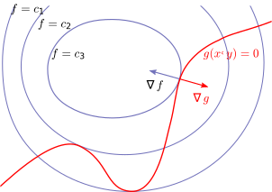

<!--@include: ./pages/notation.md-->

# Extrema

In this part of the course we work on the following skills:

- Locating and classifying the extrema of scalar fields.
- Applying Lagrange's multipliers method to optimize quantities with respect to constraints.

See also the [additional exercises](/pages/exercises3) associated to this part of the course.

In the previous chapter we introduced various notions of differentials for higher dimensional functions (scalar fields, vector fields, paths, etc.). This part of the course is devoted to searching for extrema (minima / maxima) in various different scenarios. This extends what we already know for functions in $\bR$ and we will find that in higher dimensions more possibilities and subtleties exist.

## Extrema (minima / maxima / saddle)

Let $S\subset \bR^n$ be open, $f:S \to \bR$ be a scalar field and
$\aa \in S$.

::: tip Definition
If $f(\aa)\leq f(\xx)$ (resp. $f(\aa)\geq f(\xx)$) for all $\xx \in S$,
then $f(\aa)$ is said to be the _absolute_ minimum (resp. maximum) of
$f$.
:::

::: tip Definition
If $f(\aa)\leq f(\xx)$ (resp. $f(\aa)\geq f(\xx)$) for all
$\xx \in B(\aa,r)$ for some $r>0$, then $f(\aa)$ is said to be a
_relative_ minimum (resp. maximum) of $f$.
:::

Collectively we call the these points the _extrema_ of the scalar field.
In the case of a scalar field defined on $\bR^2$ we can visualize the
scalar field as a 3D plot like the [figure](#fig:bumps).
Here we see the extrema as the "flat" places. We sometimes use _global_
as a synonym of _absolute_ and _local_ as a synonym of _relative_.

 = x e^{-(x^2y^2)}  + \\frac{1}{4}e^{y^\\frac{3}{10}}$"){#fig:bumps}

To proceed it is convenient to connect the extrema with the behaviour of
the gradient of the scalar field.

::: theorem {#thm:is-stationary}
If $f:S\to\bR$ is differentiable and has a relative minimum or maximum at
$\aa$, then $\nabla f(\aa)=  \mathbf{0}$.
:::

::: details Proof
Suppose $f$ has a relative minimum at $\aa$ (or consider $-f$). For any
unit vector $\vv$ let $g(u) = f(\aa+u\vv)$. We know that $g:\bR \to \bR$
has a relative minimum at $u=0$ so $u'(0)=0$. This means that the
directional derivative $D_{\vv} f(\aa) = 0$ for every $\vv$.
Consequently this means that $\nabla f (\aa)= \mathbf{0}$.
:::

 = \\mathbf{0}$ doesn't imply a minimum or maximum at $\\aa$, even in $\\bR$, as seen with the function $f(x)=x^3$. In higher dimensions even more is possible."){#fig:inflection}

Observe that, here and in the subsequent text, we can always consider the case of $f:\bR \to \bR$, i.e., the case of $\bR^n$ where $n=1$. Everything still holds and reduces to the arguments and formulae previously developed for functions of one variable.

::: tip Definition (stationary point)
If $\nabla f(\aa)=\mathbf{0}$ then $\aa$ is called a _stationary point_.
:::

=x^2+y^2$ then $\\nabla f(x,y) = \\left(\\begin{smallmatrix} 2x\\\\2y \\end{smallmatrix}\\right)$ and $\\nabla f(0,0) =\\left(\\begin{smallmatrix}   0\\\\0  \\end{smallmatrix}\\right)$. The point $(0,0)$ is an absolute minimum for $f$.")

As we see in the inflection example, the converse of the [above theorem](#thm:is-stationary) fails in the sense that a stationary
point might not be a minimum or a maximum. The motivates the following.

::: tip Definition (saddle point)
If $\nabla f(\aa)=\mathbf{0}$ and $\aa$ is neither a minimum nor a maximum then $\aa$ is said to be a _saddle point_.
:::

The quintessential saddle has the shape seen in the [graph](#fig:pringle). However it might be similar to an [inflection in 1D](#fig:inflection) or more complicated using the possibilities
available in higher dimension.

=x^2-y^2$ then $\\nabla f(x,y) = \\left(\\begin{smallmatrix} 2x  \\\\ -2y \\end{smallmatrix}\\right)$ and $\\nabla f(0,0) = \\mathbf{0}$. The point $(0,0)$ is a saddle point for $f$."){#fig:pringle}

## Hessian matrix

To proceed it is useful to develop the idea of a second order Taylor expansion in this higher dimensional setting. In particular this will allow us to identify the local behaviour close to stationary points. The main object for doing this is the _Hessian matrix_. Let $f:\bR^2 \to\bR$ be twice differentiable and use the notation
$f(x,y)$. The _Hessian matrix_ at $\aa\in \bR^2$ is defined as

$$
\mathbf{H} f (\aa)= \begin{pmatrix}
\frac{\partial^2 f}{\partial x^2} (\aa)
& \frac{\partial^2 f}{\partial x\,\partial y} (\aa)
\\[1.5ex]
\frac{\partial^2 f}{\partial y\,\partial x} (\aa)
& \frac{\partial^2 f}{\partial y^2}(\aa)
\end{pmatrix}.
$$

Observe that the Hessian matrix $\mathbf{H} f (\aa)$ is a symmetric matrix since [we know that](/pages/part2#implicit-functions-partial-derivatives)

$$
\frac{\partial^2 f}{\partial x\,\partial y} (\aa) = \frac{\partial^2 f}{\partial y\,\partial x} (\aa)
$$

for twice differentiable functions.

::: details The Hessian matrix is defined analogously in any dimension.
Let $f:\bR^n \to\bR$ be twice differentiable. The _Hessian matrix_ at $\aa\in \bR^n$ is defined as

$$
\mathbf{H} f (\aa)= \begin{pmatrix}
\frac{\partial^2 f}{\partial x_1^2} (\aa)
& \frac{\partial^2 f}{\partial x_1\,\partial x_2} (\aa)
& \cdots
& \frac{\partial^2 f}{\partial x_1\,\partial x_n}(\aa) \\[1.5ex]
\frac{\partial^2 f}{\partial x_2\,\partial x_1} (\aa)
& \frac{\partial^2 f}{\partial x_2^2}(\aa)
& \cdots
& \frac{\partial^2 f}{\partial x_2\,\partial x_n}(\aa) \\[1.5ex]
\vdots
& \vdots
& \ddots
& \vdots \\[1.5ex]
\frac{\partial^2 f}{\partial x_n\,\partial x_1} (\aa)
& \frac{\partial^2 f}{\partial x_n\,\partial x_2} (\aa)
& \cdots
& \frac{\partial^2 f}{\partial x_n^2}(\aa)
\end{pmatrix}.
$$

:::

Observe that the Hessian matrix is a real symmetric matrix in any dimension. If $f:\bR \to \bR$ then $\mathbf{H} f (a)$ is a $1\times 1$ matrix and coincides with the second derivative of $f$. In this sense what we know about extrema in $\bR$ is just a special case of everything we do here.

As an example, let $f(x,y)=x^2-y^2$ ([figure](#fig:pringle)). The gradient and the Hessian are respectively

$$
\begin{aligned}
\nabla f(x,y) & =\begin{pmatrix}
\frac{\partial f}{\partial x} (x,y) \\[2pt]
\frac{\partial f}{\partial y} (x,y)
\end{pmatrix} = \begin{pmatrix}
2x \\-2y
\end{pmatrix}, \\
\mathbf{H} f (x,y) & = \begin{pmatrix}
\frac{\partial^2 f}{\partial x^2} (x,y)
& \frac{\partial^2 f}{\partial x\,\partial y} (x,y)
\\[2pt]
\frac{\partial^2 f}{\partial y\,\partial x} (x,y)
& \frac{\partial^2 f}{\partial y^2}(x,y)
\end{pmatrix}
= \begin{pmatrix}
2 & 0 \\ 0 & -2
\end{pmatrix}.
\end{aligned}
$$

The point $(0,0)$ is a stationary point since
$\nabla f(0,0) =\left(\begin{smallmatrix}
            0\\0
        \end{smallmatrix}\right)$. In this example $\mathbf{H} f$ does
not depend on $(x,y)$ but in general we can expect dependence and so it
gives a different matrix at different points $(x,y)$.

::: theorem
If $\vv= \left( v_1, \dots, v_n \right)$ then,

$$
\vv \ \mathbf{H} f (\aa) \ \vv^{\mathbf{T}} = \sum_{j,k=0}^{n}
   \frac{\partial^2 f}{\partial x_j\partial x_k} (\aa)
    v_j v_k \in \bR.
$$

:::

::: details Proof
Multiplying the matrices we calculate that

$$
\begin{aligned}
            \vv \ \mathbf{H} f (\aa) \ \vv^{\mathbf{T}}
             & =
            \begin{pmatrix}
                v_1 & \cdots & v_n
            \end{pmatrix}
            \begin{pmatrix}
                \partial_{1}\partial_{1}f(\aa) & \cdots &
                \partial_{1}\partial_{n}f(\aa)                   \\
                \vdots                         & \ddots & \vdots \\
                \partial_{n}\partial_{1}f(\aa) & \cdots &
                \partial_{n}\partial_{n}f(\aa)
            \end{pmatrix}
            \begin{pmatrix}
                v_1 \\ \vdots \\v_n
            \end{pmatrix} \\
             & = \sum_{j,k=0}^{n}
            \partial_{j}\partial_{k}f(\aa)
            v_j v_k
        \end{aligned}
$$

as required.

:::

### Second order Taylor formula for scalar fields

First let's recall the first order Taylor approximation [we saw before](./part2#thm:differential). If $f$ is differentiable at $\aa$ then

$$
f(\xx) \approx f(\aa)  + \nabla f(\aa) \cdot (\xx-\aa).
$$

If $\aa$ is a stationary point then this only tells us that $f(\xx) \approx f(\aa)$ so a natural next question is to search for slightly more detailed information.

::: theorem
Let $f$ be a scalar field twice differentiable on $B(\aa,r)$. Then, for $\xx$ close to $\aa$,
$$f(\xx) \approx f(\aa) + \nabla f(\aa) \cdot (\xx-\aa) + \frac{1}{2} {(\xx-\aa)} \ \mathbf{H} f (\aa) \ (\xx-\aa)^{\mathbf{T}}$$
in the sense that the error is $\littleO{\norm{(\xx-\aa)}^2}$.
:::

::: details Proof
Let $\vv = \xx-\aa$ and let $g(u) = f(\aa + u \vv)$. The Taylor
expansion of $g$ tells us that
$g(1) = g(0) + g'(0) + \frac{1}{2} g''(c)$ for some $c\in (0,1)$. Since
$g(u) = f(a_1 + uv_1, \ldots, a_n + u v_n)$, by the chain rule,

$$
\begin{aligned}
g'(u) & = \sum_{j=1}^{n} \partial_j f( a_1 + uv_1, \ldots, a_n + u v_n ) v_j
=\nabla f( \aa + u \vv) \cdot \vv, \\
g''(u) & = \sum_{j,k=1}^{n} \partial_j\partial_k f( a_1 + uv_1, \ldots, a_n + u v_n ) v_j v_k \\
& \quad \quad \quad
= \vv^{\mathbf{T}} \ \mathbf{H} f (\aa + u \vv) \ \vv.
\end{aligned}
$$

Consequently
$f(\aa+\vv) = f(\aa) + \nabla f(\aa) \cdot \vv + \frac{1}{2} \vv^{\mathbf{T}} \ \mathbf{H} f (\aa + c\vv) \ \vv$.
We define the "error" in the approximation as
$\epsilon(\vv) = \frac{1}{2}  \vv^{\mathbf{T}} (\mathbf{H} f (\aa + c\vv) - \mathbf{H} f (\aa)  ) \vv$
and estimate that

$$
\abs{\epsilon(\vv)} \leq \sum_{j,k=0}^{n}
v_j v_k \left( \partial_{j}\partial_{k}f(\aa+c\vv)-\partial_{j}\partial_{k}f(\aa) \right).
$$

Since $\abs{ v_j v_k} \leq \norm{\vv}^2$ we observe that
$\frac{\abs{\epsilon(\vv)} }{\norm{\vv}^2} \to 0$ as $\norm{\vv} \to 0$
as required.
:::

## Classifying stationary points

In order to classify the stationary points we will take advantage of the Hessian matrix and therefore we need to first understand the follow fact about real symmetric matrices.

::: theorem
Let $A$ be a real symmetric matrix and let $Q(\vv) =  \vv^{\mathbf{T}} A  \vv$.
Then

$$
\begin{aligned}
\text{\(Q(\vv) > 0\) for all \(\vv \neq \mathbf{0}\)}
& \quad \Longleftrightarrow \quad
\text{all eigenvalues of \(A\) are positive}, \\
\text{\(Q(\vv) < 0\) for all \(\vv \neq \mathbf{0}\)}
& \quad \Longleftrightarrow \quad
\text{all eigenvalues of \(A\) are negative}.
\end{aligned}
$$

:::

::: details Proof

Since $A$ is symmetric it can be diagonalised by matrix $B$ which is
orthogonal ($B^{\mathbf{T}}=B^{-1}$) and the diagonal matrix
$D = B^{\mathbf{T}} A B$ has the eigenvalues of $A$ as the diagonal.
This means that
$Q(\vv) = \vv^{\mathbf{T}} B^{\mathbf{T}} B A B^{\mathbf{T}} B \vv = \ww^{\mathbf{T}} D \ww$
where $\ww = B \vv$. Consequently $Q(\vv) =  \sum_{j} \lambda_j w_j^2$.
Observe that, if all $\lambda_j >0$ then $\sum_{j} \lambda_j w_j^2  >0$.

In order to prove the other direction in the "if and only if" statement,
observe that $Q(B \uu_k ) = \lambda_k$. This means that, if $Q(\vv) > 0$
for all $\vv \neq \mathbf{0}$ then $\lambda_k>0$ for all $k$.
:::

::: theorem
Let $f$ be a scalar field twice differentiable on $B(\aa,r)$. Suppose
$\nabla f(\aa) = \mathbf{0}$ and consider the eigenvalues of
$\mathbf{H} f (\aa)$. Then

$$
\begin{aligned}
\text{{All} eigenvalues are positive}
    & \quad \Longrightarrow \quad
\text{relative minimum at \(\aa\)}, \\
\text{{All} eigenvalues are negative}
    & \quad \Longrightarrow \quad
\text{relative maximum at \(\aa\)}, \\
\text{Some positive, some negative}
    & \quad \Longrightarrow \quad
\text{\(\aa\) is a saddle point}.
\end{aligned}
$$

:::

::: info Proof
Let $Q(\vv) =  \vv^{\mathbf{T}} \mathbf{H} f (\aa) \vv$, $\ww = B \vv$
and let $\Lambda := \min_j \lambda_j$. Observe that
$\norm{\ww} =  \norm{\vv}$ and that
$Q(\vv)=  \sum_{j} \lambda_j w_j^2  \geq \Lambda \sum_{j} w_j^2 = \Lambda  \norm{\vv}^2$.
We have them 2^nd^-order Taylor

$$
\begin{aligned}
            f(\aa+\vv) - f(\aa)
             & =  \frac{1}{2} \vv^{\mathbf{T}} \ \mathbf{H} f (\aa) \ \vv +  \epsilon(\vv)                \\
             & \geq  \left(\tfrac{\Lambda}{2} - \tfrac{\epsilon(\vv)}{\norm{\vv}^2} \right) \norm{\vv}^2.
        \end{aligned}
$$

Since
$\frac{\abs{\epsilon(\vv)}}{\norm{\vv}^2} \to 0$ as $\norm{\vv}\to 0$,
$\frac{\abs{\epsilon(\vv)}}{\norm{\vv}^2} < \tfrac{\Lambda}{2}$ when
$\norm{\vv}$ is small. The argument is analogous for the second part.
For final part consider $\vv_j$ which is the eigenvector for $\lambda_j$
and apply the argument of the first or second part.

:::

## Attaining extreme values

Here we explore the extreme value theorem for continuous scalar fields. The argument will be in two parts: Firstly we show that continuity implies boundedness; Secondly we show that boundedness implies that the maximum and minimum are attained. We use the following notation for _interval_ / _rectangle_ / _cuboid_ / _tesseract_, etc. If $\aa = (a_1,\ldots,a_n)$ and $\bb = (b_1,\ldots,b_n)$ then we consider the $n$-dimensional closed Cartesian product

$$
[\aa,\bb] = [a_1,b_1] \times \cdots \times [a_n,b_n].
$$

We call this set a _rectangle_ (independent of the dimension). As a first step it is convenient to know that all sequences in our setting have convergent subsequences.

::: theorem
If ${\{\xx_{n}\}}_{n}$ is a sequence in $[\aa,\bb]$ there exists a
convergent subsequence ${\{\xx_{n_j}\}}_{j}$.
:::

::: details Proof
In order to prove the theorem we construct the subsequence. Firstly we
divide $[\aa,\bb]$ into sub-rectangles of size half the original. We
then choose a sub-rectangle which contains infinite elements of the
sequence and choose the first of these elements to be part of the
sub-sequence. We repeat this process by again dividing the sub-rectangle
we chose by half and choosing the next element of the subsequence. We
repeat to give the full subsequence.
:::

::: theorem
Suppose that $f$ is a scalar field continuous at every point in the
closed rectangle $[\aa,\bb]$. Then $f$ is bounded on $[\aa,\bb]$ in the
sense that there exists $C>0$ such that $\abs{f(\xx)} \leq C$ for all
$\xx \in [\aa,\bb]$.
:::

::: details Proof
Suppose the contrary: for all $n\in\mathbb{N}$ there exists $\xx_n\in [\aa,\bb]$ such that $\abs{f(\xx_n)}>n$. [Bolzano-Weierstrass](https://en.wikipedia.org/wiki/Bolzano%E2%80%93Weierstrass_theorem)
theorem means that there exists a subsequence ${\{\xx_{n_j}\}}_{j}$ converges to $\xx \in [\aa,\bb]$. Continuity of $f$ means that $f(\xx_{n_j})$ converges to $f(\xx)$. This is a contradiction and hence the theorem is proved.
:::

We can now use the above result on the boundedness in order to show that the extreme values are actually obtained.

::: theorem
Suppose that $f$ is a scalar field continuous at every point in the closed rectangle $[\aa,\bb]$. Then there exist points $\xx, \yy \in [\aa,\bb]$ such that

$$
f(\xx) = \inf f
        \quad \text{and} \quad
        f(\yy)= \sup f.
$$

:::

::: details Proof
By the boundedness theorem $\sup f$ is finite and so there exists a sequence ${\{\xx_{n}\}}_{n}$ such that $f(\xx_n)$ converges to $\sup f$. Bolzano-Weierstrass theorem implies that there exists a subsequence ${\{\xx_{n_j}\}}_{j}$ which converges to $\xx \in [\aa,\bb]$. By
continuity $f(\xx_n) \to f(\xx) = \sup f$.
:::

## Extrema with constraints (Lagrange multipliers)

We now consider a slightly different problem to the one earlier in this chapter. There we wished to find the extrema of a given scalar field. Here the general problem is to minimise or maximise a given scalar field $f(x,y)$ under the constraint $g(x,y) = 0$. Subsequently we will also consider the same problem but in higher dimensions. For this graphic representation we draw the constraint and also various level sets of the function that we want to find the extrema of. The graphical representation suggests to us that at the "touching point" the gradient vectors are parallel. In other words, $\nabla f = \lambda \nabla g$ for some $\lambda \in \bR$. The implementation of this idea is the [method of Lagrange multipliers](https://en.wikipedia.org/wiki/Lagrange_multiplier).

Suppose that a differentiable scalar field $f(x,y)$ has a relative minimum or maximum when it is subject to the constraint $g(x,y) = 0$. Then there exists a scalar $\lambda$ such that, at the extrema point,
$$\nabla f = \lambda \nabla g.$$

{#fig:lagrange}

In three dimensions a similar result holds. Suppose that a differentiable scalar field $f(x,y,z)$ has a relative minimum or maximum when it is subject to the constraints

$$
g_{1}(x,y,z) = 0,
        \quad
        g_{2}(x,y,z) = 0
$$

and the $\nabla g_k$ are linearly independent. Then there exist scalars $\lambda_1$, $\lambda_2$ such that, at the extrema point,
$$\nabla f = \lambda_{1} \nabla g_{1} + \lambda_{2} \nabla g_{2}.$$

In higher dimensions and possibly with additional constraints we have
the following general theorem.

::: theorem
Suppose that a differentiable scalar field $f(x_1,\ldots,x_n)$ has an
relative extrema when it is subject to $m$ constraints

$$
g_1(x_1,\ldots,x_n) = 0, \dots , g_m(x_1,\ldots,x_n)=0,
$$

where $m<n$, and the $\nabla g_k$ are all linearly independent. Then there exist $m$ scalars $\lambda_1,\ldots,\lambda_m$ such that, at each extrema point,

$$
\nabla f = \lambda_1 \nabla g_1 + \cdots + \lambda_m \nabla g_m.
$$

:::

::: details The Lagrange multiplier method is often stated and far less often proved.
Since the proof is rather involved we will follow this tradition here. See, for example, Chapter 14 of "A First Course in Real Analysis" (2012) by Protter & Morrey for a complete proof and further discussion.
:::

::: info Idea of proof
Let us consider a particular case of the method when $n=3$ and $m=2$. More precisely we consider the following problem: Find the maxima and minima of $f(x,y,z)$ along the curve $C$ defined as

$$
g_1(x,y,z) = 0,
    \quad
    g_2(x,y,z) = 0
$$

where $g_1$, $g_2$ are differentiable functions. In this particular case we will prove the Lagrange multiplier method. Suppose that $\aa$ is some point in the curve. Let $\boldsymbol{\alpha}(t)$ denote a path which lies in the curve $C$ in the sense that $\boldsymbol{\alpha}(t) \in C$ for all $t\in (-1,1)$, $\boldsymbol{\alpha}'(t)\neq \mathbf{0}$ and $\boldsymbol{\alpha}(0)=\aa$. If $\aa$ is a local minimum for $f$ restricted to $C$ it means that $f(\boldsymbol{\alpha}(t))\geq f(\boldsymbol{\alpha}(0))$ for all $t \in (-\delta,\delta)$ for some $\delta>0$. In words, moving away from $\aa$ along the curve $C$ doesn't cause $f(\xx)$ to decrease. Let $h(t) = f(\boldsymbol{\alpha}(t))$ and observe that $h:\bR \to \bR$ so we know how to find the extrema. In particular we know that $h'(0)=0$. By the chain rule $h'(t) = \nabla f(\boldsymbol{\alpha}(t))\cdot \boldsymbol{\alpha}'(t)$ and so

$$
\nabla f(\aa)\cdot \boldsymbol{\alpha}'(0) = 0.
$$

Since we know that $g_1(\boldsymbol{\alpha}(t))=0$ and $g_2(\boldsymbol{\alpha}(t))=0$, again by the chain rule,

$$
\nabla g_1(\aa)\cdot \boldsymbol{\alpha}'(0) = 0,
    \quad
    \nabla g_2(\aa)\cdot \boldsymbol{\alpha}'(0) = 0.
$$

To proceed it is convenient to isolate the following result of linear algebra.

> Consider $w, u_1,u_2 \in \bR^3$ and let $V = \{v : u_k \cdot v = 0, k =1,2\}$. If $w\cdot v =0$ for all $v \in V$ then $w = \lambda_1 u_1 + \lambda_2 u_2$ for some $\lambda_1,\lambda_2 \in \bR$.

In order to prove this we write $w = \lambda_1 u_1 + \lambda_2 u_2 + v_0$ where $v_0 \in V$
because $u_1, u_2$ together with $V$ must span $\bR^3$. Since
$v_0 \in V$ and, by assumption, $w\cdot v_0 = 0$,

$$
0 = w\cdot v_0
        = (\lambda_1 u_1 + \lambda_2 u_2 + v_0)\cdot v_0
        = v_0\cdot v_0
        = \norm{v_0}^2.
$$

This means that $v_0 =0$ and so
$w = \lambda_1 u_1 + \lambda_2 u_2$.

The above statement holds in any dimension with any number of vectors with the analogous proof. Applying this lemma to the vectors $\nabla f(\aa)$, $\nabla g_1(\aa)$ and $\nabla g_2(\aa)$ recovers exactly the Lagrange multiplier method in this setting.
:::
