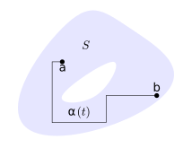
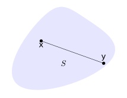
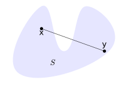

<!--@include: ./pages/notation.md-->

::: warning
Draft text ⚠️
:::

# Curves & line integrals

See also the [additional exercises](/pages/exercises4) associated to this part of the course.

Curves have played a part in earlier parts of the course and now we turn our attention to precisely what we mean by this notion. Up until now we relied more on an intuition, an idea of some type of 1D subset of higher dimensional space. We will also define how we can integrate scalar and vector fields along these curves. These types of integrals have a natural and important physical relevance. We will then study some of the properties of these integrals. To start let's recall a random selection of curves we have already seen:

- Circle: $x^2+y^2 = 4$
- Semi-circle: $x^2+y^2 = 4$,   $x\geq 0$
- Ellipse: $\frac{1}{4} x^2 + \frac{1}{9} y^2 = 4$
- Line: $y=5x+2$
- Line (in 3D): $x+2y+3z=0$,   $x=4y$
- Parabola (in 3D): $y=x^2$,   $z=x$

In the above list the curves are written in a way where we are describing a set of points using certain constraint or constraints. In some cases in _implicit_ form, in some cases in _explicit_ form. For example, for the circle we formally mean the set $\{(x,y):x^2+y^2 = 4\}$. We have the idea that the curves should be sets which are single connected pieces and we vaguely have an idea that we need curves that are sufficiently smooth. To proceed we need a precise definition of the 1D objects we can work with. As part of the definition we force a structure which really allows us to work with these objects in a useful way.

## Curves, paths & line integrals

Let $\aalpha : [a,b] \to \bR^n$ be continuous. For convenience, in components we write $\aalpha(t) = (\alpha_1(t),\ldots,\alpha_n(t))$. We say that $\aalpha(t)$ is _differentiable_ if each component $\alpha_k(t)$ is differentiable on $[a,b]$ and $\alpha_k'(t)$ is continuous

::: tip Definition {#def:differentiable}
We say that $\aalpha(t)$ is _piecewise differentiable_ if $[a,b] = [a,c_1]\cup[c_1,c_2] \cup \cdots \cup [c_l,b]$ and $\aalpha(t)$ is _differentiable_ on each of these intervals.
:::

::: tip Definition {#def:path}
If $\aalpha: [a,b] \to \bR^n$ is piecewise differentiable then we call it a _path_.
:::

Note that different functions can trace out the _same_ curve in different ways. Also note that a path has an inherent direction. We say that this is a _parametric representation_ of a given curve. We already saw examples of paths in [spiral](#fig:spiral) and [circular motion](#fig:particle-circle). A few examples of paths are as follows.

- $\aalpha(t)= (t,t)$, $t\in[0,1]$
- $\aalpha(t) = (\cos t, \sin t)$, $t\in[0,2\pi]$
- $\aalpha(t) = (\cos t, \sin t)$, $t\in [-\frac{\pi}{2},\frac{\pi}{2}]$
- $\aalpha(t) = (\cos t, -\sin t)$, $t\in[0,2\pi]$
- $\aalpha(t)= (t,t,t)$, $t\in[0,1]$
- $\aalpha(t)=(\cos t, \sin t, t)$, $t\in [-10,10]$

Observe how some of these paths represent the same curve, perhaps traversed in a different direction.

Let $\aalpha(t)$ be a (piecewise differentiable) path on $[a,b]$ and let $\ff: \bR^n\to\bR^n$ be a continuous vector field. Recall that we consider $\aalpha'(t)$ and $\ff(\xx)$ as $n$-vectors. I.e., in the case $n=2$, then

$$
\aalpha'(t) = \left(
\begin{smallmatrix}
        \alpha_1'(t) \\ \alpha_2'(t)
    \end{smallmatrix}
\right), \quad \ff(\xx) = \left(
\begin{smallmatrix}
        f_1(\xx) \\ f_2(\xx)
    \end{smallmatrix}
\right).
$$

::: tip Definition (Line integral) {#def:line-integral-vector}
The _line integral_ of the vector field $\ff$ along the path $\aalpha$ is defined as
$$\int \ff \cdot d\aalpha = \int_{a}^{b} \ff(\aalpha(t)) \cdot \aalpha'(t) \ dt.$$
:::

Sometimes the same integral is written as $\int_C \ff \cdot d\aalpha$ to emphasize that the integral is along the curve $C$. Alternatively the integral is sometimes written as $\int f_1 \ d\alpha_1 + \cdots + f_n \ d\alpha_n$ or $\int f_1 \ dx_1 + \cdots + f_n \ dx_n$. Each of these different notations are in common usage in different contexts but the underlying quantity is always the same.

Consider the vector field $\ff(x,y) = \left(\begin{smallmatrix}
        \sqrt y \\ x^3 + y
    \end{smallmatrix}\right)$ and the path $\aalpha(t)= (t^2,t^3)$ for $t \in (0,1)$. Evaluate $\int \ff \cdot d\aalpha$.

We start by calculating

$$
\aalpha'(t) = \begin{pmatrix}
            2t \\ 3t^2
        \end{pmatrix},\\
        \quad
        \ff(\aalpha(t)) = \begin{pmatrix}
            t^{\frac{3}{2}} \\ t^6 + t^3
        \end{pmatrix}.
$$

This means that $\ff(\aalpha(t)) \cdot  \aalpha'(t) =    2 t^{\frac{5}{2}} + 3t^8 + 3t^5$ and so

$$
\displaystyle\int \ff \cdot d\aalpha = \displaystyle\int_{0}^{1} (2 t^{\frac{5}{2}} + 3t^8 + 3t^5 ) \ dt = \frac{59}{42}.
$$

## Basic properties of the line integral

Having defined the line integral, the next step is to clarify its behaviour, in particular the following key properties.

**Linearity:** Suppose $\ff$, $\mathbf{g}$ are vector fields and $\aalpha(t)$ is a path. For any $c,d\in \bR$, then

$$
\int (c\ff + d\mathbf{g}) \cdot d\aalpha =  c \int \ff  \cdot d\aalpha +  d \int \mathbf{g} \cdot d\aalpha.
$$

**Joining / splitting paths:** Suppose $\ff$ is a vector field and that

$$
\aalpha(t) = \begin{cases}
        \aalpha_1(t) & t\in [a,c] \\
        \aalpha_2(t) & t\in [c,b]
    \end{cases}
$$

is a path. Then

$$
\int \ff  \cdot d\aalpha = \int \ff  \cdot d\aalpha_1  + \int \ff  \cdot d\aalpha_2.
$$

Alternatively, if we write $C$, $C_1$, $C_2$ for the corresponding curves, then

$$
\int_{C} \ff  \cdot d\aalpha = \int_{C_1} \ff  \cdot d\aalpha + \int_{C_2} \ff  \cdot d\aalpha.
$$

As already mentioned, for a given curve there are many different choices of parametrization. For example, consider the curve $C = \{(x,y) : x^2 + y^2 = 1, y\geq 0\}$. This is a semi-circle and two possible parametrizations are $\aalpha(t) = (-t, \sqrt{1-t^2})$, $t\in [-1,1]$ and $\bbeta(t) = (\cos t, \sin t)$, $t\in [0,\pi]$. These are just two possibilities among many possible choices. For a given curve, to what extent does the line integral depend on the choice of parametrization?

We say that two paths $\aalpha(t)$ and $\bbeta(t)$ are _equivalent_ if there exists a differentiable function $u : [c,d] \to [a,b]$ such that $\aalpha(u(t)) = \bbeta(t)$.

Furthermore, we say that $\aalpha(t)$ and $\bbeta(t)$ are

- _in the same direction_ if $u(c)=a$ and $u(d)=b$,

- _in the opposite direction_ if $u(c)=b$ and $u(d)=a$.

With this terminology we can precisely describe the dependence of the integral on the choice of parametrization.

::: tip Theorem {#thm:change-param}
Let $\ff$ be a continuous vector field and let $\aalpha$, $\bbeta$ be equivalent paths. Then

$$
\int \ff \cdot d\aalpha =
        \begin{cases}
            \int \ff \cdot d\bbeta   & \text{if the paths are in the same direction},     \\
            - \int \ff \cdot d\bbeta & \text{if the paths are in the opposite direction}.
        \end{cases}
$$

:::

Suppose that the paths are continuously differentiable path, decomposing if required. Since $\aalpha(u(t)) = \bbeta(t)$ the chain rule implies that $\bbeta'(t) = \aalpha'(u(t)) \ u'(t)$. In particular

$$
\displaystyle \int \ff \cdot  d\bbeta = \displaystyle \int_c^d \ff(\bbeta(t)) \cdot \bbeta'(t) \ dt =  \displaystyle \int_c^d \ff(\aalpha(u(t))) \cdot \aalpha'(u(t)) \ u'(t) \ dt.
$$

Changing variables, adding a minus sign if path is opposite direction because we need to swap the limits of integration, completes the proof.

### Gradients & work

Let $h(x,y)$ be a scalar field in $\bR^2$ and recall that the gradient $\nabla h(x,y)$ is a vector field. Let $\aalpha(t)$, $t\in [0,1]$ be a path. Now let $g(t) = h(\aalpha(t))$, consider the derivative $g'(t) = \nabla h(\aalpha(t))\cdot \aalpha'(t)$ and evaluate the line integral

$$
\begin{aligned}
        \int \nabla h \cdot d\aalpha
         & = \int_0^1 \nabla h(\aalpha(t)) \cdot \alpha'(t)\ dt \\
         & = \int_0^1 g(t) \ dt
        = g(1) - g(0)
        = h(\aalpha(1)) - h(\aalpha(0)).
    \end{aligned}
$$

This equality has the following intuitive interpretation if we suppose for a moment that $h$ denotes altitude. In this case the line integral is the sum of all the infinitesimal altitude changes and equals the total change in altitude.

As a first example of work in physics let's consider gravity. The gravitational field on earth is $\ff(x,y,z) = \left(\begin{smallmatrix} 0 \\ 0 \\ mg \end{smallmatrix}\right)$. If we move a particle from $\aa=(a_1,a_2,a_3)$ to $\bb=(b_1,b_2,b_3)$ along the path $\aalpha(t)$, $t\in [0,1]$ then the work done is defined as $\int \ff \cdot d\aalpha$. We calculate that

$$
\begin{aligned}
        \int \ff \cdot d\aalpha
         & = \int_0^1 \ff(\aalpha(t)) \cdot \aalpha'(t) \ dt
        = \int_0^1 mg \ \alpha_3'(t) \ dt                          \\
         & = mg \ {\left[ \alpha_3(t)\right]}_0^1 = mg(b_3 - a_3).
    \end{aligned}
$$

This coincides we what we know, work done depends only on the change in height.

As a second example of work in physics let's consider a particle moving in a force field. Let $\ff$ be the force field and let $\xx(t)$ be the position at time $t$ of a particle moving in the field. Let $\vv(t) = \xx'(t)$ be the velocity at time $t$ of the particle and define kinetic energy as $\frac{m}{2} \norm{\vv(t)}^2$. According to Newton's law $\ff(\xx(t)) = m\xx''(t) = m \vv'(t)$ and so the work done is

$$
\begin{aligned}
        \int \ff \cdot d\xx
         & = \int_0^1 \ff(\xx(t)) \cdot \vv(t) \ dt
        = \int_0^1 m\vv'(t) \cdot \vv(t) \ dt                                   \\
         & = \int_0^1 \tfrac{d}{dt} \left( \tfrac{m}{2} \norm{\vv(t)}^2 \right)
        = \left(  \tfrac{m}{2} \norm{\vv(1)}^2  -  \tfrac{m}{2} \norm{\vv(0)}^2   \right)
    \end{aligned}
$$

In this case we see, as expected, the work done on the particle moving in the force field is equal to the change in kinetic energy.

## The second fundamental theorem

Recall that, if $\varphi:\bR \to \bR$ is differentiable then $\int_a^b \varphi'(t) \ dt = \varphi(b) - \varphi(a)$. This is called the [second fundamental theorem of calculus](https://en.wikipedia.org/wiki/Fundamental_theorem_of_calculus#Second_part) and is one of the ways in which we see that differentiation and integration are opposites. The analog for line integrals is the following.

Suppose that $\varphi$ is a continuously differentiable scalar field on $S \subset \bR^n$ and suppose that $\aalpha(t)$, $t\in[a,b]$ is a path in $S$. Let $\aa = \aalpha(a)$, $\bb = \aalpha(b)$. Then
$$\int \nabla \varphi \cdot d\aalpha = \varphi(\bb) - \varphi(\aa).$$

Suppose that $\aalpha(t)$ is differentiable. By the chain rule $\frac{d}{dt} \varphi(\aalpha(t)) = \nabla \varphi(\aalpha(t))\cdot \aalpha'(t)$. Consequently

$$
\int \nabla \varphi \cdot d\aalpha
        = \int_0^1 \nabla \varphi(\aalpha(t)) \cdot \aalpha'(t)\ dt
        = \int_0^1 \tfrac{d}{dt} \varphi(\aalpha(t)) \ dt.
$$

By the 2^nd^ fundamental theorem in $\bR$ we know that $\int_0^1 \tfrac{d}{dt} \varphi(\aalpha(t)) \ dt = \varphi(\aalpha(b)) - \varphi(\aalpha(a))$.

Our earth has mass $M$ with centre at $(0,0,0)$. Suppose that there is a small particle close to earth which has mass $m$. The force field of gravitation and potential energy are, respectively,

$$
\ff(\xx) = \frac{-GmM}{\norm{\xx}^3}\xx,
        \quad
        \varphi(\xx) = \frac{GmM}{\norm{\xx}}.
$$

We can calculate $\nabla \varphi(\xx)$ and see that it is equal to $\ff(\xx)$.

## The first fundamental theorem

First we need to consider a basic topological property of sets. In particular we want to avoid the possibility of the set being several disconnected pieces, in other words we want to guarantee that we can get from one point to another in the set in a way without every leaving the set (see [figure](#fig:connected).

::: tip Definition
The set $S\subset \bR^n$ is said to be _connected_ if, for every pair of points $\aa,\bb\in S$, there exists a path $\aalpha(t), t\in[a,b]$ such that

- $\aalpha(t)\in S$ for every $t\in[a,b]$,
- $\aalpha(a)=\aa$ and $\aalpha(b)=\bb$.

:::

Sometimes this property is called "path connected" to distinguish between different notions.

{#fig:connected}

Recall that, if $f:\bR \to \bR$ is continuous and we let $\varphi(x) = \int_a^x f(t) \ dt$ then $\varphi'(x) = f(x)$. This is called the [first fundamental theorem of calculus](https://en.wikipedia.org/wiki/Fundamental_theorem_of_calculus#First_part) and is the other way in which we see that differentiation and integration are opposites. Again we have an analog for the line integral but here it becomes a little more subtle since there are many different paths along which we can integrate between any two points.

Let $\ff$ be a continuous vector field on a connected set $S \subset \bR^n$. Suppose that, for $\xx,\aa\in S$, the line integral $\int \ff \cdot d\aalpha$ is equal for every path $\aalpha$ such that $\aalpha(a)=\aa$, $\aalpha(b)=\xx$. Fix $\aa\in S$ and define $\varphi(\xx)= \int \ff \cdot d\alpha$. Then $\varphi$ is continuously differentiable and $\nabla \varphi = \ff$.

As before let $\ee_1 = \left(\begin{smallmatrix}
            1 \\ 0 \\ 0
        \end{smallmatrix}\right)$, $\ee_2 = \left(\begin{smallmatrix}
            0 \\ 1 \\ 0
        \end{smallmatrix}\right)$, $\ee_3 = \left(\begin{smallmatrix}
            0 \\ 0 \\ 1
        \end{smallmatrix}\right)$. Observe that, if we define the paths $\bbeta_k(t) = \xx + t \ee_k$, $t\in [0,h]$, then

$$
\varphi(\xx + h \ee_k) - \varphi(\xx) = \int \ff \cdot d\bbeta_k.
$$

Moreover $\bbeta'_k(t) = \ee_k$. Consequently

$$
\begin{aligned}
            \frac{\partial \varphi}{\partial x_k}(\xx)
             & =  \displaystyle\lim_{h\to 0} \frac{1}{h}( \varphi(\xx + h \ee_k) - \varphi(\xx))                \\
             & = \displaystyle \lim_{h\to 0} \frac{1}{h} \int_0^h \ff(\bbeta_k(t)) \cdot \ee_k \ dt = f_k(\xx).
        \end{aligned}
$$

In other words, we have shown that $\nabla \varphi (\xx) =  \ff(\xx)$.

We say a path $\aalpha(t)$, $t\in [a,b]$ is _closed_ if $\aalpha(a) = \aalpha(b)$.

Observe that, if $\aalpha(t)$, $t\in[a,b]$ is a closed path then we can divided it into two paths: Let $c\in[a,b]$ and consider the two paths $\aalpha(t)$, $t\in[a,c]$ and $\aalpha(t)$, $t\in[c,b]$. On the other hand, suppose $\aalpha(t)$, $t\in [a,b]$ and $\bbeta(t)$, $t\in [c,d]$ are two path starting at $\aa$ and finishing at $\bb$. The these can be combined to define a closed path (by following one backward).

A vector field $\ff$, continuous on $S \subset \bR^n$ is _conservative_ if there exists a scalar field $\varphi$ such that, on $S$,
$$\ff = \nabla \varphi.$$

Note that some authors call such a vector field a _gradient_ (i.e., the vector field is the gradient of some scalar). If $\ff = \nabla \varphi$ then the scalar field $\varphi$ is called the _potential_ (associated to $\ff$). Observe that that the potential is not unique, $\nabla \varphi = \nabla(\varphi + C)$ for any constant $C \in \bR$.

::: tip Theorem (Conservative fields){#thm:conservative-fields}
Let $S \subset \bR^n$ and and consider the vector field $\ff : S \to \bR^n$. The following are equivalent:

1.  $\ff$ is conservative, i.e., $\ff = \nabla \varphi$ on $S$ for some $\varphi$,
2.  $\int \ff \cdot d\aalpha$ does not depend on $\aalpha$, as long as $\aalpha(a)=\aa$, $\aalpha(b)=\bb$,
3.  $\int \ff \cdot d\aalpha = 0$ for any closed path $\aalpha$ contained in $S$.

:::

In the previous theorems (the two fundamental theorems) we proved that (i) is equivalent to (ii).

Now we prove that (ii) implies (iii): Let $\aalpha(t)$ be a closed path and let $\bbeta(t)$ be the same path in the opposite direction. Observe that $\int \ff \cdot d\aalpha = - \int \ff \cdot d \bbeta$ but that $\int \ff \cdot d \aalpha = \int \ff \cdot d \bbeta$ and so $\int \ff \cdot d \aalpha = 0$.

It remains to prove that (iii) implies (ii): The two paths between $\aa$ and $\bb$ can be combined (with a minus sign) to give a closed path.

::: tip Theorem (mixed partial derivatives){#thm:mixed-partials-2D}
Suppose that $S \subset \bR^2$ and that $\ff:S \to \bR^2$ is a differentiable vector field and write $\ff = \left(\begin{smallmatrix}
            f_1 \\ f_2
        \end{smallmatrix}\right)$.

If $\ff$ is conservative then, on $S$,
$$\frac{\partial f_1}{\partial y} = \frac{\partial f_2}{\partial x}.$$
:::

The above result is a special case of the following general statement which holds in any dimension.

::: tip Theorem (mixed partial derivatives){#thm:mixed-partials}
Suppose that $\ff$ is a differentiable vector field[^1] on $S\subset \bR^n$. If $\ff$ is conservative then, for each $l,k$,
$$\frac{\partial f_l}{\partial x_k} = \frac{\partial f_k}{\partial x_l}.$$
:::

By assumption the second order partial derivatives exist and so

$$
\tfrac{\partial f_l}{\partial x_k}
        = \tfrac{\partial^2 \varphi}{\partial x_k \partial x_l}
        = \tfrac{\partial^2 \varphi}{\partial x_l \partial x_k}
        = \tfrac{\partial f_k}{\partial x_l}.
$$

Consider the vector field

$$
\ff(x,y) = \left(\begin{smallmatrix}
                -y {(x^2 + y^2)}^{-1} \\ x {(x^2 + y^2)}^{-1}
            \end{smallmatrix}\right)
$$

on $S = \bR^2 \setminus (0,0)$. Calculating we verify that $\tfrac{\partial f_1}{\partial y} = \tfrac{\partial f_2}{\partial x}$ on $S$. We now evaluate the line integral $\int \ff \cdot d\aalpha$ where $\aalpha(t) = (a \cos t, a \sin t)$, $t\in [0,2\pi]$. We calculate that

$$
\aalpha'(t) = \left(\begin{smallmatrix}
            -a \sin t \\ a \cos t
        \end{smallmatrix}\right), \quad \ff(\aalpha(t)) = \frac{1}{a^2} \left(\begin{smallmatrix}
            -a \sin t \\ a \cos t
        \end{smallmatrix}\right).
$$

This means that
$$\int \ff \cdot d\aalpha = \int_{0}^{2\pi} ( \sin^2 t + \cos^2 t )\ dt = 2\pi.$$

Observe that in the above example $S$ is somehow not a "nice" set because of the "hole" in the middle. Moreover, observe that the line integral is the same for any circle, independent of the radius.

The [mixed partials theorem](#thm:mixed-partials) isn't useful in showing that a vector field is conservative because it is possible for the mixed partial derivatives to all be equal but still the field fail to be conservative. On the other hand, if a pair of mixed derivatives is not equal then $\ff$ is _not_ conservative and so it is useful for proving the negative. Later in this chapter we will return to this topic.

## Potentials & conservative vector fields

We now turn our attention to the following question: Suppose we are given a vector field $\ff$ and we know that $\ff = \nabla \varphi$ for some $\varphi$. How can we find $\varphi$? For this we consider two methods in the following paragraphs.

First we describe the method which we call _constructing a potential by line integral_. Suppose that $\ff$ is a conservative vector field on the rectangle $[a_1,b_1]\times [a_2,b_2]$. We define $\varphi(\xx)$ as the line integral $\int \ff \cdot d\aalpha$ where $\aalpha$ is a path between $\aa=(a_1,a_2)$ and $\xx$. For any $\xx = (x_1,x_2) \in \bR^2$ consider the two paths:

- $\aalpha_1(t) = (t,a_2)$, $t\in [a_1,x_1]$,

- $\aalpha_2(t) = (x_1,t)$, $t\in [a_2,x_2]$.

Let $\aalpha(t)$ denote the concatenation of the two paths. We calculate that

$$
\int \ff \cdot d\aalpha = \int_{a_1}^{x_1} \ff(\aalpha_1(t))\cdot \aalpha_1'(t) \ dt +  \int_{a_2}^{x_2} \ff(\aalpha_2(t))\cdot \aalpha_2'(t) \ dt.
$$

This means that $\varphi(\xx)  = \int_{a_1}^{x_1} f_1(t,a_2)\ dt + \int_{a_2}^{x_2} f_2(x_1,t)\ dt$.

Now we describe a different method which we describe as _constructing a potential by indefinite integrals_. Again suppose that $\ff = \nabla \varphi$ for some scalar field $\varphi(x,y)$ which we wish to find. Observe that $\frac{\partial \varphi}{\partial x} = f_1$ and $\frac{\partial \varphi}{\partial y} = f_2$. This means that

$$
\int_{a}^{x} f_1(t,y) \ dt + A(y) = \varphi(x,y) =  \int_{b}^{y} f_2(x,t) \ dt + B(x)
$$

where $A(y)$, $B(x)$ are constants of integration. Calculating and comparing we can then obtain a formula for $\varphi(x,y)$.

Find a potential for $\ff(x,y) = \left(\begin{smallmatrix}
        e^x y^2 + 1\\ 2e^x y
    \end{smallmatrix}\right)$ on $\bR^2$.

We calculate that

$$
\begin{aligned}
            \int_{a}^{x} f_1(t,y) \ dt + A(y)
             & =  \ e^x y^2 + x + A(y) = \varphi(x,y), \\
            \int_{b}^{y} f_2(x,t) \ dt + B(x)
             & =  e^x y^2 + B(x) = \varphi(x,y).
        \end{aligned}
$$

From this we see that we can choose $A(y) = 0$ and $B(x)=x$ to obtain equality of the above quantities. Consequently we obtain the potential $\varphi(x,y) = e^x y^2 + x$.

The [mixed partials theorem](#thm:mixed-partials) concerning conservative fields and the mixed partial derivatives was somewhat less than satisfactory since the converse wasn't possible. In order to get a more satisfactory result we need to look at another topological details of the domain of the vector field. This concept is somewhat suggested by the methods of constructing potentials which were described above.

::: tip Definition (convex){#def:convex}
A set $S\subset \bR^n$ is said to be _convex_ if for any $\xx,\yy\in S$ the segment $\{t\xx + (1-t)\yy, t\in[0,1]\}$ is contained in $S$.
:::

This extra property permits the following sufficient condition for a vector field to be conservative.

::: tip Theorem {#thm:conservative-convex}
Let $\ff$ be a differentiable vector field on a convex region $S\subset \bR^n$. Then $\ff$ is conservative if and only if

$$
\tfrac{\partial f_l}{\partial x_k} = \tfrac{\partial f_k}{\partial x_l},
        \quad \text{for each \(l,k\)}.
$$

:::

We have already proved that $\ff$ being conservative implies the equality of partial derivatives ([mixed partials theorem](#thm:mixed-partials)) and therefore we need only assume that $\partial_g f_l = \partial_l f_k$ and construct a potential. Let $\varphi(\xx) = \int \ff \cdot d\aalpha$ where $\aalpha(t) = t\xx$, $t\in[0,1]$. Since $\aalpha'(t) = \xx$, $\varphi(\xx) = \int_0^1 \ff(t\xx)\cdot \xx \ dt$. Also (needs proving)

$$
\frac{\partial \varphi}{\partial x_k}(t\xx) = \int_{0}^{1} \left( t \partial_k \ff(t\xx) \cdot \xx + f_k(t\xx) \right) \ dt.
$$

This is equal to $\int_{0}^{1} \left( t \nabla f_k(t\xx) \cdot \xx + f_k(t\xx) \right) \ dt$ because $\partial_g f_l = \partial_l f_k$; By the chain rule applied to $g(t) = t \nabla f_k(t\xx)$ this is equal to $f_k(\xx)$ as required.

The above gives us a useful tool to check if a given vector field is conservative. Using the idea of "gluing together" several convex regions this result can be manually extended to some more general settings. Later, we will take advantage of some further ideas in order to significantly extend this result.

### Application to exact differential equations

Let $S\subset \bR^2$ be simply-connected and open. The differential equation, considered on $S$,

$$
p(x,y) + q(x,y) y'(x) = 0
$$

is called _exact_ if there exists $\varphi : S \to \bR$ such that $p = \frac{\partial \varphi}{\partial x}$ and $q = \frac{\partial \varphi}{\partial y}$. [Exact differential equations](https://en.wikipedia.org/wiki/Exact_differential_equation) are closely related to conservative vector fields.

::: tip Theorem {#thm:exact-diff-eq}
Let $S\subset \bR^2$ be connected and open.

- Suppose that $\varphi: S \to \bR$ satisfies $\nabla \varphi =   \left(\begin{smallmatrix}
                      p\\ q
                  \end{smallmatrix}\right)$. Then the solution $y(x)$ of the equation $p(x,y) + q(x,y) y'(x) = 0$ satisfies $\varphi(x,y(x))=C$ for some $C\in \bR$.
- Conversely, if $\varphi: S \to \bR$ is such that $\varphi(x,y(x))=C$ defines implicitly a function $y(x)$, then $y(x)$ is a solution to the equation $p(x,y) + q(x,y) y'(x) = 0$.

:::

If $y(x)$ satisfies $\varphi(x,y(x))=C$, then by the chain rule and the fact that $\nabla \varphi =   \left(\begin{smallmatrix}
        p \\ q
    \end{smallmatrix}\right)$, we see that $p(x,y(x)) + y'(x) q(x,y(x)) = 0$. Conversely, if $y(x)$ is a solution, $\varphi(x,y(x))$ must be constant in $x$.

Solve $y^2 + 2xyy' = 0$. Let $p(x,y) = y^2$, $q(x,y) = 2xy$ and find $\varphi(x,y) = xy^2$ so $\nabla \varphi = \left(\begin{smallmatrix}
            p\\ q
        \end{smallmatrix}\right)$. Solutions satisfy $\varphi(x,y(x))= x {y(x)}^2 =C$, i.e., $y(x) = \sqrt{\frac{C}{x}}$.

## Line integrals of scalar fields

Up until now this chapter has been devoted to line integrals of vector fields but there is also the obvious question of defining the line integral for scalar fields. This we do now. Such a line integral allows us also to define the _length of a curve_ in a meaningful way. Let $\aalpha(t)$, $t\in [a,b]$ be a path in $\bR^n$ and let $f:\bR^n \to \bR$.

::: tip Definition (scalar line integral){#def:line-integral-scalar }
The _line integral_ of the scalar field $f$ along the path $\aalpha$ is defined as

$$
\int f \ d\alpha = \int_a^b f(\alpha(t)) \ \norm{\aalpha'(t)} \ dt.
$$

:::

This integral shares the same basic properties of the line integral of a vector field and the proofs are essentially the same. Namely it is linear and also respects how a path can be decomposed or joined with other paths which changing the value of the integral. Moreover, the value of the integral along a given path is independent of the choice of parametrization of the curve. In this case, even if the curve is parametrized in the opposite direction then the integral takes the same value. Consequently it makes sense to define the length of the curve as the line integral of the unit scalar field, i.e., the length of a curve parametrized by the path $\aalpha$ is $\int_a^b \norm{\aalpha'(t)} \ dt$.

As a simple application, consider that the path represents a wire and the wire has density $f(\aalpha(t))$ at the point $\aalpha(t)$. Then the mass of the wire is equal to $\int  f \ d\alpha$.
