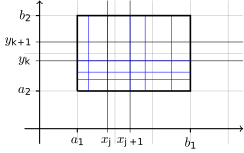
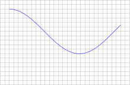
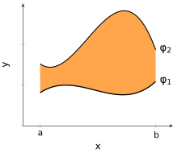
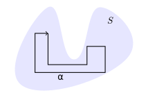
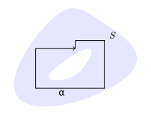

<!--@include: notation.md-->

# Multiple integrals

See also the [additional exercises](/pages/exercises5) associated to this part of the course. If you want more, Chapter 5 (plus sections 6.3 and 6.4) of [OpenStax Calculus Volume 3](https://openstax.org/details/books/calculus-volume-3) is a good option.

The extension to higher dimension of differentiation was established in the previous chapters. We then defined line integrals which are, in a sense, one dimensional integrals which exist in a high dimensional setting. We now take the next step and define higher dimensional integrals in the sense of how to integrate a scalar field defined on a subset of $\bR^n$. The first step will be to rigorously define which scalar fields are integrable and to define the integral. Then we need to find reasonable ways to evaluate such integrals. Among other applications we will use this multiple integrals to calculate volumes and moment of inertia. In Green's Theorem we find a connection between multiple integrals and line integrals. We also develop the important topic of change of variables which takes advantage of the Jacobian determinant and is often invaluable for actually working with a given problem.

## Definition of the integral

First we need to find a definition of integrability and the integral. Then we will proceed to study the properties of this higher dimensional integral. Recall that, in the one-dimensional case integration was defined using the following steps:

1.  Define the integral for step functions,

2.  Define integral for "integrable functions",

3.  Show that continuous functions are integrable.

For higher dimensions we follow the same logic. We will then show that we can evaluate higher dimensional integrals by repeated one-dimensional integration.

:::definition partition
Let $R = [a_1,b_1] \times [a_2,b_2]$ be a rectangle. Suppose that $P_1 = \{x_0,\ldots,x_m\}$ and $P_2 = \{y_0,\ldots,y_n\}$ such that $a_1 = x_0 < x_1 < \cdots < x_m = b_1$ and $a_2 = y_0 < y_1 < \cdots < y_n = b_2$. $P= P_1 \times P_2$ is said to be a _partition_ of $R$.
:::

Observe that a partition divides $R$ into $nm$ sub-rectangles. If $P \subseteq Q$ then we say that $Q$ is a finer partition than $P$. Partitions are constructed in higher dimension, for $\bR^n$, in an analogous way. Before defining integration for general functions it is convenient to make the definition for a special class of functions called step functions.

:::definition step function
A function $f:R\to \bR$ is said to be a _step function_ if there is a partition $P$ of $R$ such that $f$ is constant on each sub-rectangle of the partition.
:::

If $f$ and $g$ are step functions and $c,d \in \bR$, then $c f + d g$ is also a step function. Also note that the area of the sub-rectangle $Q_{jk}:=[x_{j},x_{j+1}]\times [y_{k},y_{k+1}]$ is equal to $(x_{j+1}-x_{j})(y_{k+1}-y_{k})$.

We can now define the integral of a step function in a reasonable way. The definition here is for 2D but the analogous definition holds for any dimension.

Suppose that $f$ is a step function with value $c_{jk}$ on the sub-rectangle $(x_{j},x_{j+1})\times (y_{k},y_{k+1})$. Then we define the integral as

$$
\iint_{R} f \ dx dy = \sum_{j=0}^{m-1} \sum_{k=0}^{n-1} c_{jk} (x_{j+1}-x_{j})(y_{k+1}-y_{k}).
$$

This should remind you of Riemann sums from Analysis I.
Observe that the value of the integral is independent of the partition, as long as the function is constant on each sub-rectangle. In this sense the integral is well-defined (not dependent on the choice of partition used to calculate it).

::: theorem {#thm:props-integral }
Let $f,g$ be step functions. Then

$$
\begin{aligned}
            \textstyle\iint\limits_{R} (a f + b g) \ dx dy
             & = a  \textstyle\iint\limits_{R} f \ dx dy + b \textstyle\iint\limits_{R} g \ dx dy
             \quad \text{for all \(a,b\in \bR\)},\\
            \textstyle\iint\limits_{R} f \ dx dy
             & =  \textstyle\iint\limits_{R_1} f \ dx dy +  \textstyle\iint\limits_{R_2} f \ dx dy \quad
             \text{ if \(R\) is divided into \(R_1\) and \(R_2\)}, \\
            \textstyle\iint\limits_{R} f \ dx dy
             & \leq  \textstyle\iint\limits_{R} g \ dx dy \quad
            \text{ if \(f(x,y) \leq g(x,y)\)}.
        \end{aligned}
$$

:::

:::info Proof
All properties follow from the definition by basic calculations.
:::

We are now in the position to define the set of integrable functions. In order to define integrability we take advantage of "upper" and "lower" integrals which "sandwich" the function we really want to integrate.

::: tip Definition (integrability on a rectangle) {#def:integrability*rectangle}
Let $R$ be a rectangle and let $f: R \to \bR$ be a bounded function. We call $f$ an \_integrable* function if there is one and only one number $I\in \bR$ such that

$$
\iint_{R} g(x,y) \ dx dy \leq I \leq \iint_{R} h(x,y) \ dx dy
$$

for every pair of step functions $g, h$ such that, for all $(x,y)\in R$,

$$
g(x,y) \leq f(x,y) \leq h(x,y).
$$

This number $I$ is called the integral of $f$ on $R$ and is denoted $\iint_{R} f(x,y) \ dx dy$.
:::

All the basic properties of the integral of step functions, as stated in [the above Theorem](#thm:props-integral), also hold for the integral of any integrable functions. This can be shown by considering the limiting procedure of the upper and lower integral of step functions which are part of the definition of integrability.

The most important words in the definition are "only one number": that's what we need to check to verify that a function is integrable.
That still isn't immediately easy to check and so it is convenient to now investigate the integrability of continuous functions.

::: theorem {thm:continuous_integrable}
Suppose that $f$ is a continuous function defined on the rectangle $R$. Then $f$ is integrable.
:::

::: info Proof
Continuity implies boundedness and so upper and lower integrals exist. Let $\epsilon>0$. Exists $\delta>0$ such that $\abs{f(\xx)-f(\yy)}\leq \epsilon$ whenever $\norm{\xx-\yy}\leq \delta$. We can choose a partition such that $\norm{\xx-\yy}\leq \delta$ whenever $\xx,\yy$ are in the same sub-rectangle $Q_{jk}$. We then define the step functions $g,h$ s.t. $g(\xx)=\inf_{Q{jk}} f$, $h(\xx)=\sup_{Q{jk}} f$ when $\xx\in Q_{jk}$.
To finish the proof we observe that $\abs{\inf_{Q{jk}} f - \sup_{Q{jk}} f }\leq \epsilon$ and $\epsilon>0$ can be made arbitrarily small, so we can make the upper and lower integrals as close as we want.
:::

## Evaluation of multiple integrals

Now we have a definition, so we know what a multidimensional integral is, and we also know that some interesting ones exist, but it is essential to also have a way to practically evaluate any given integral. It turns out we can do that by integrating in one variable at a time:

:::theorem Fubini {thm:fubini_rectangle}

Let $f$ be an integrable function on the rectangle $R = [a_1,b_1] \times [a_2,b_2]$. Then

$$
\iint_{R} f(x,y) \ dx dy
        = \int_{a_2}^{b_2} \left[ \int_{a_1}^{b_1} f(x,y) \ dx  \right] \ dy
        = \int_{a_1}^{b_1} \left[\int_{a_2}^{b_2}  f(x,y) \ dy  \right] \ dx.
$$

:::

::: info Proof
To see this, think about any pair of step functions $g,h$ such that $g\leq f \leq h$.
Since these are step functions,

$$
	\iint_R g(x,y) \ dx dy
	=
	\int_{a_2}^{b_2} \left[ \int_{a_1}^{b_1} g(x,y) \ dx  \right] \ dy
	=
	\int_{a_1}^{b_1} \left[ \int_{a_2}^{b_2} g(x,y) \ dy  \right] \ dx
$$

since these are all just different names for the same sum, and the same is true for $h$.
Using this,

$$
	\iint_R g(x,y) \ dx dy
	\leq
        \int_{a_2}^{b_2} \left[ \int_{a_1}^{b_1} f(x,y) \ dx  \right] \ dy
	\leq
	\iint_R h(x,y) \ dx dy
;
$$

in other words the iterated integral in the middle is bounded from above and below by the same upper and lower integrals as the integral of $f$, which leaves only one possible value

$$
        \int_{a_2}^{b_2} \left[ \int_{a_1}^{b_1} f(x,y) \ dx  \right] \ dy
	=
	\iint_R f(x,y) \ dx dy
$$

and the other equality holds for the same reason.
:::

This integral naturally allows us to calculate the volume of a solid. Let $f(x,y)\leq z \leq g(x,y)$ be defined on the rectangle $R \subset \bR^2$ and consider the 3D set defined as

$$
V = \left\{(x,y,z): (x,y)\in R, f(x,y)\leq z \leq g(x,y) \right\}.
$$

The volume of the set $V$ is equal to $\operatorname{Vol}(V) = \iint_{R} \left[ g(x,y) - f(x,y) \right] \ dx dy$.

$")

Up until now we have considered step function and continuous functions. As with one-dimensional integrals we can permit some discontinuities and we introduce the following concept to be able to control the functions with discontinuities sufficiently to guarantee that the integrals are well-defined.

::: definition Content zero sets
A bounded subset $A\subset \bR^2$ is said to have content zero if, for every $\epsilon>0$, there exists a finite set of rectangles whose union includes $A$ and the sum of the areas of the rectangles is not greater than $\epsilon$.
:::

Examples of content zero sets include: finite sets of points; bounded line segments; continuous paths.

::: theorem

Suppose that $\varphi$ is a continuous function on $[a,b]$. Then the graph $\big\{(x,y): x\in [a,b], y=\varphi(x)\big\}$ has zero content.

:::

::: info Proof
By continuity, for every $\epsilon>0$, there exists $\delta>0$ such that $\abs{\varphi(x) - \varphi(y)}\leq \epsilon$ whenever $\abs{x-y}\leq \delta$. We then take partition of $[a,b]$ into subintervals of length less than $\delta$. Using this partition we generate a cover of the graph which has area not greater than $2\epsilon \abs{b-a}$.
:::

:::theorem

Let $f$ be a bounded function on $R$ and suppose that the set of discontinuities $A\subset R$ has content zero. Then the double integral $\iint_{R}f(x,y) \ dx dy$ exists.
:::

::: info Proof
Take a cover of $A$ by rectangles with total area not greater than $\delta>0$. Let $P$ be a partition of $R$ which is finer than the cover of $A$. We may assume that $\abs{\inf_{Q{jk}} f - \sup_{Q{jk}} f }\leq \epsilon$ on each sub-rectangle of the partition which doesn't contain a discontinuity of $f$. The contribution to the integral of bounding step functions from the cover of $A$ is bounded by $\delta \sup \abs{f}$.
:::

## Regions bounded by functions

A major limitation is that we have only integrated over rectangles whereas we would like to integrate over much more general different shaped regions. This we develop now.

Suppose $S\subset R$ and $f$ is a bounded function on $S$. We extend $f$ to $R$ by defining

$$
f
_R(x,y) = \begin{cases}
        f(x,y) & \text{if \((x,y)\in S\)} \\
        0      & \text{otherwise}.
    \end{cases}
$$

We use this notation in the following definition.

:::definition
We say that $f : S \to \bR$ is integrable if $f_{R}$ is integrable and define

$$
\iint_{S} f(x,y) \ dx dy = \iint_{R} f_{R}(x,y) \ dx dy.
$$

:::

Suppose that there are continuous functions $\varphi_1$, $\varphi_2$ on $\bR$ and consider the set

$$
S = \left\{(x,y): a \leq x \leq b, \varphi_1(x) \leq y \leq \varphi_2(x)\right\} \subset \bR^2.
$$

Not all sets can be written in this way but many can and such a way of describing a subset of $\bR^2$ is convenient for evaluating integrals. We will call sets that can be written this way Type 1 sets in this section.

Let $S = \left\{(x,y): x \in [a,b], \varphi_1(x) \leq y \leq \varphi_2(x)\right\}$ where $\varphi_1, \varphi_2$ are continuous and let $f$ be a bounded continuous function of $S$. Then $f$ is integrable on $S$ and

$$
\iint_{S} f(x,y) \ dx dy = \int_{a}^{b} \left[\int_{\varphi_1(x)}^{\varphi_2(x)} f(x,y) \ dy\right] \ dx:
$$

the set of discontinuity of $f_{R}$ is the boundary of $S$ in $R=[a,b]\times[\tilde a,\tilde b]$ which consists of the graphs of $\varphi_1$, $\varphi_2$. These graphs have zero content as we proved before. For each $x$, $f(x,y)$ is integrable since it has only two discontinuity points. Additionally $\int_{\tilde a}^{\tilde b} f_{R}(x,y) \ dy =  \int_{\varphi_1(x)}^{\varphi_2(x)} f(x,y) \ dy$. Observe that it doesn't make a different to the integral if we use $<$ or $\leq$ in the definition of $S$ since the difference would be a content zero set.

We could also consider the following set

$$
R = \left\{(x,y): a \leq y \leq b, \varphi_1(y) \leq x \leq \varphi_2(y)\right\},
$$

which we will call a Type 2 set. This is just the same situation as above with the roles of $x$ and $y$ switched, that is

$$
\iint_{R} f(x,y) \ dx dy = \int_{a}^{b} \left[\int_{\varphi_1(y)}^{\varphi_2(y)} f(x,y) \ dx\right] \ dy.
$$

In the first case we could describe the representation as projecting along the $y$-coordinate whereas in the second case we are projecting along the $x$-coordinate. Many interesting sets are both Type 1 and Type 2, although very often one form is more obvious or more useful than the other.

For higher dimensions we need to also have an understanding of how to represent subsets of $\bR^n$. Take for example a 3D solid; then we would hope to be able to "project" along one of the coordinate axis and so describe it using the 2D "shadow" and a pair of continuous functions. For example, consider the upside-down cone [in this figure](#fig:cone){reference-type="ref" reference="fig:cone"} which has base of radius $5$ lying in the plane $\{z=5\}$ and has its tip at the origin.

In order to describe this set it is convenient to imagine how it projects down onto the $xy$-axis. We then describe it as

$$
V = \left\{(x,y,z) : (x,y) \in S, \gamma_1(x,y)\leq z \leq \gamma_2(x,y) \right\}
$$

where $S \subset \bR^2$ is the "shadow" and the functions represent the control we need in the vertical direction. In this case we must choose $S = \{(x,y): x^2 + y^2 \leq 5^2\}$since the base of the cone, at the top of the picture, it the largest part in terms of the shadow. We also must choose $\gamma_1(x,y) = \sqrt{x^2 + y^2}$ and $\gamma_2(x,y) = 5$ to correspond to the sloped lower surface and the horizontal upper surface.

## Applications of multiple integrals

Multiple integrals can be used to calculate the area or volume of a given set. Suppose that

$$
S = \left\{(x,y): x \in [a,b], \varphi_1(x) \leq y \leq \varphi_2(x)\right\}  \subset \bR^2
$$

where $\varphi_1$, $\varphi_2$ are continuous functions. The the area of $S$ is

$$
\iint_{S} \ dx dy = \int_{a}^{b} \left[ \int_{\varphi_1(x)}^{\varphi_2(x)} \ dy\right] \ dx
    = \int_{a}^{b} [ \varphi_2(x) - \varphi_1(x) ] \ dx.
$$

This corresponds to the usual notion of the integral of a function on $\bR$ determining the area under the curve. The same idea extends to arbitrary dimension. Suppose that $\gamma_1(x,y) \leq \gamma_2(x,y)$ are continuous functions on $S$ and let

$$
V = \left\{ (x,y,z) :  x \in [a,b], \varphi_1(x) \leq y \leq \varphi_2(x), \gamma_1(x,y) \leq z \leq \gamma_2(x,y)  \right\} \subset \bR^3.
$$

The volume of $V$ is

$$
\begin{aligned}
        \iiint_{V} \ dx dy dz
         & =  \int_{a}^{b}
        \left[ \int_{\varphi_1(x)}^{\varphi_2(x)}  \left[ \int_{ \gamma_1(x,y)}^{ \gamma_2(x,y)} \ dz \right] dy \right] \ dx \\
         & =  \int_{a}^{b}
        \left[ \int_{\varphi_1(x)}^{\varphi_2(x)}   [  \gamma_2(x,y)  -   \gamma_1(x,y) ] dy \right] \ dx.
    \end{aligned}
$$

Multiple integrals also allow us to calculate the mass and centre of mass of solids. Suppose we have several particles each with mass $m_k$ and located at point $(x_k,y_k)$. The total mass would then be $M = \sum_{k} m_k$ and the centre of mass is the point $(p,q)$ such that

$$
p M = \sum_{k} m_k x_k
    \quad \text{and} \quad
    q M = \sum_{k} m_k y_k.
$$

Suppose an object has the shape of a region $S$ and the density of the material is $f(x,y)$ at point $(x,y)$. Then, similar to the discrete case above, the total mass is $M = \iint_{S} f(x,y) \ dx dy$ and the centre of mass is the point $(p,q)$ such that

$$
p M = \iint_{S} x \ f(x,y) \ dx dy
    \quad \text{and} \quad
    q M = \iint_{S} y \ f(x,y) \ dx dy.
$$

By tradition, if the density is constant, then the centre of mass is called the _centroid_.

## Green's theorem

We can now establish a connection between multiple integrals and the line integrals of the previous chapter.

::: theorem Green's {#thm:greens}
Let $C\subset\bR^2$ be a piecewise-smooth simple (no intersections) curve and $\aalpha$ a path that parametrizes $C$ in the counter-clockwise direction. Let $S$ be the region enclosed by $C$. Suppose that $\ff(x,y) = \left(\begin{smallmatrix}
            P(x,y) \\ Q(x,y)
        \end{smallmatrix}\right)$ is a vector field continuously differentiable on an open set containing $S$. Then

$$
\iint_{S} \left(\tfrac{\partial Q}{\partial x} - \tfrac{\partial P}{\partial y}\right) \ dx dy = \int_{C} \ff \cdot d\aalpha.
$$

:::

::: info Proof
To start we assume that $S$ is a type 1 region and that $Q=0$, Since $S = \left\{(x,y): x \in [a,b], \varphi_1(x) \leq y \leq \varphi_2(x)\right\}$,

$$
\begin{aligned}
            \iint_{S}  \left(\tfrac{\partial Q}{\partial x} - \tfrac{\partial P}{\partial y}\right) \ dx dy
             & =
            \int_{a}^{b}\left[\int_{\varphi_1(x)}^{\varphi_2(x)}  (- \tfrac{\partial P}{\partial y}) \ dy\right] \ dx \\
             & = \int_{a}^{b}  [P(x,\varphi_1(x))-P(x,\varphi_2(x))]   dx,
        \end{aligned}
$$

It is then natural to choose four paths $\aalpha_1(t) = (t,\varphi_1(t))$, $\aalpha_2(t) = (a,t)$, $\aalpha_3(t) = (t,\varphi_2(t))$, $\aalpha_4(t) = (b,t)$. We can calculate that
$$\int_{C} \ff \cdot d\aalpha = \int \ff \cdot d\aalpha_1 - \int \ff \cdot d\aalpha_3 = \int_{a}^{b} P(t,\varphi_1(t)) \ dt -  \int_{a}^{b} P(t,\varphi_2(t)) \ dt.$$
If $S$ is also type 2 then this works for $P=0$ and linearity means it works for $\ff = \left(\begin{smallmatrix}
            P \\ 0
        \end{smallmatrix}\right)+\left(\begin{smallmatrix}
            0 \\ Q
        \end{smallmatrix}\right)$, More general regions can be formed by "glueing" together simpler regions of the above type to complete the argument.
:::

The quantity $\tfrac{\partial Q}{\partial x} - \tfrac{\partial P}{\partial y}$ is reminiscent of something we saw with conservative vector fields and we take advantage of this with the following application. We previously introduced the concept of _connected sets_ but now we need a slight refinement of the idea.

::: tip Definition (simply connected) {#def:simply-connected}
A connected set $S\subset \bR^n$ is said to be _simply-connected_ if any closed path $\aalpha$, contained within $S$, can be contracted to a point. (This is in the sense that there exists a continuous map $F:D^{2}\to S$, where $D^2\subset \bR^2$ denotes the unit disk, such that $F$ restricted to the unit circle is $\aalpha$.)
:::

The following result extends [the theorem about conservative vector fields from Part 4](part4#thm:conservative-convex){reference-type="ref" reference="thm:conservative-convex"} which was limited to convex sets.

::: theorem {#thm:conservative-fields-simply-connected}
Let $S$ be a simply connected region and suppose that $\ff = \left(\begin{smallmatrix}
            P \\ Q
        \end{smallmatrix}\right)$ is a vector field, continuously differentiable on $S$. Then $\ff$ is conservative if and only if $\tfrac{\partial Q}{\partial x} = \tfrac{\partial P}{\partial y}$.

:::

::: info Proof
In [the mixed partials theorem](part4#thm:mixed-partials) we already proved that $\tfrac{\partial Q}{\partial x} = \tfrac{\partial P}{\partial y}$ whenever $\ff$ is conservative so we need only prove the other direction of the statement. Suppose that $\tfrac{\partial Q}{\partial x} = \tfrac{\partial P}{\partial y}$ and consider any closed path $\aalpha$ in $S$. Then [Green's theorem](#thm:greens) tells us that

$$
\int_{C} \ff \cdot d\aalpha = \iint_{S} \left(\tfrac{\partial Q}{\partial x} - \tfrac{\partial P}{\partial y}\right) \ dx dy = 0.
$$

This implies that $\ff$ is conservative because the fact that the line integral around every closed curve is zero (using [a theorem from Part 4](part4#thm:conservative-fields)).
:::

A crucially important consequence of the above result is that it implies the invariance of a line integral under deformation of a path when the vector field is conservative. Observe that the result can be extended to multiply connected regions by adding additional "cuts" and keeping track of the additional line integrals.

## Change of variables

When we want to identify a point in space it is common, particularly if we are pirates recording the position of treasure, that there are many alternative ways we can describe this point. For example we could write the number of steps north and the number of steps east from the central palm tree. Alternatively we can specify that we stand at the palm tree looking in a specific direction and then walk a particular number of steps. Often is is really convenient to swap from one coordinate to another and in this section we show how multiple integrals behave under change of coordinates.

To start, we recall the 1D case. If $g : [a,b] \to [g(a),g(b)]$ is onto with continuous derivative and $f$ is continuous then

$$
\int_{g(a)}^{g(b)}    f(x) \ dx = \int_{a}^{b} f(g(u)) \ g'(u) \ du.
$$

In higher dimension we obtain a similar result but $g'$ must be replaced by a type of derivative which works in higher dimension.

For the 2D case we have the following result.

::: theorem change of variables {#thm:change-variable-2D}
Suppose that $(u,v) \mapsto (X(u,v),Y(u,v))$ maps $T$ to $S$ one-to-one and $X$, $Y$ are continuously differentiable. Then

$$
\iint_{S} f(x,y) \ dx dy = \iint_{T} f(X(u,v),Y(u,v)) \ \abs{J(u,v)} \ du dv.
$$

:::

Here $J(u,v) = \left({\begin{smallmatrix}
        \partial_u X & \partial_u Y \\ \partial_v X & \partial_v Y
    \end{smallmatrix}}\right)$ is the Jacobian matrix as used previously. Note that the Jacobian represents the scaling of volume in the sense that $\iint_{S} \ dx dy = \iint_{T}  \abs{J(u,v)} \ du dv$.

### Polar coordinates

[Polar coordinates](https://en.wikipedia.org/wiki/Polar_coordinate_system) correspond to the coordinate mapping

$$
\begin{cases}
        x = r \cos \theta \\
        y = r \sin \theta.
    \end{cases}
$$

In this case the Jacobian determinant is

$$
\abs{J(r,\theta)}
    =
    \abs{\left(\begin{smallmatrix}
            \partial_u X & \partial_u Y \\ \partial_v X & \partial_v Y
        \end{smallmatrix}\right)}
    =
    \abs{\left(\begin{smallmatrix}
            \cos \theta & \sin \theta \\ -r\sin \theta & r\cos \theta
        \end{smallmatrix}\right)}
    = r ( \cos^2\theta + \sin^2 \theta) = r.
$$

Consequently, the change of variable in the integral gives that

$$
\iint_{S} f(x,y) \ dx dy = \iint_{T}  r  \ f(r\cos \theta, r\sin \theta)  \ drd\theta.
$$

### Linear transformations {#linear-transformations .unnumbered}

In this case the coordinate mapping is

$$
\begin{cases}
        x = Au + Bv \\
        y = Cu + Dv
    \end{cases}
$$

where $A,B,C,D \in \bR$ are chosen fixed. The Jacobian determinant is equal to

$$
\abs{J(u,v)}
    =
    \abs{\left(\begin{smallmatrix}
            \partial_u X & \partial_u Y \\ \partial_v X & \partial_v Y
        \end{smallmatrix}\right)}
    =
    \abs{\left(\begin{smallmatrix}
            A & B \\ C & D
        \end{smallmatrix}\right)}
    = \abs{AD - BC}.
$$

Consequently the change of coordinates for the integral is

$$
\iint_{S} f(x,y) \ dx dy = \abs{AD - BC} \iint_{T}   f(Au + Bv,Cu + Dv)  \ du dv.
$$

### Extension to higher dimensions

The exact analog of  [the 2D change of variables formula](#thm:change-variable-2D) holds in any dimension. In particular, in 3D, if we consider the change of variables $(u,v,w) \mapsto (X(u,v,w),Y(u,v,w),Z(u,v,w))$, then $\iiint_{S} f(x,y,z) \ dx dy dz$ is equal to

$$
\iiint_{T} f(X(u,v,w),Y(u,v,w),Z(u,v,w)) \ \abs{J(u,v,w)} \ du dv dw
$$

where $J(u,v)$ is now the Jacobian matrix of dimension $(3 \times 3)$.

### Cylindrical coordinates

[Cylindrical coordinates](https://en.wikipedia.org/wiki/Cylindrical_coordinate_system) correspond to the mapping (require $r>0$, $0\leq \theta \leq 2\pi$)

$$
\begin{cases}
        x = r \cos \theta \\
        y = r \sin \theta \\
        z = z
    \end{cases}
$$

and, in this case, the Jacobian determinant is

$$
\abs{J(r,\theta,z)}
    =
    \abs{\left(\begin{smallmatrix}
            \cos \theta    & \sin \theta   & 0 \\
            -r \sin \theta & r \cos \theta & 0 \\
            0              & 0             & 1
        \end{smallmatrix}\right)}
    =
    \abs{r (\cos^2 \theta + \sin^2 \theta)}
    = r
$$

and so the change of variables in the integral gives

$$
\iiint_{S} f(x,y,z) \ dx dy dz =  \iiint_{T} r \ F(r,\theta,z)   \ dr d\theta dz.
$$

where $F(r,\theta,z) = f(r \cos \theta, r \sin \theta,  z)$. Note that cylindrical coordinates are closely related to polar coordinates in the sense that we don't touch the $z$ coordinate and use polar coordinates for $x$ and $y$.

### Spherical coordinates {#spherical-coordinates .unnumbered}

[Spherical coordinates](https://en.wikipedia.org/wiki/Spherical_coordinate_system) correspond to how we use latitude, longitude and altitude to specify a position on earth. It is the coordinate mapping (require $\rho>0$, $0\leq \theta \leq 2\pi$, $0\leq \varphi <\pi$)

$$
\begin{cases}
        x = \rho \cos \theta \sin \varphi \\
        y = \rho \sin \theta \sin \varphi \\
        z = \rho \cos \varphi.
    \end{cases}
$$

In this case the Jacobian determinant is

$$
\abs{J(\rho,\theta,\varphi)}
    =
    \abs{\left(\begin{smallmatrix}
            \cos \theta \sin \varphi       & \sin \theta \sin \varphi      & \cos \varphi        \\
            -\rho \sin \theta \sin \varphi & \rho \cos \theta \sin \varphi & 0                   \\
            \rho \cos \theta \cos \varphi  & \rho \sin \theta \cos \varphi & - \rho \sin \varphi
        \end{smallmatrix}\right)}
    =
    \abs{- \rho^2 \sin \varphi}
    = \rho^2 \sin \varphi.
$$

Consequently the change of variables in the integral gives that

$$
\iiint_{S} f(x,y,z) \ dx dy dz =  \iiint_{T}  F(\rho,\theta,\varphi) \rho^2 \sin \varphi  \ d\rho d\theta d\varphi.
$$

where $F(\rho,\theta,\varphi) = f(\rho \cos \theta \sin \varphi, \rho \sin \theta \sin \varphi,   \rho \cos \varphi  )$.
