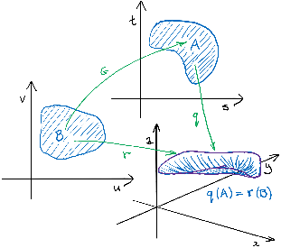

::: warning
Draft text ⚠️
:::

<!--@include: notation.md-->

# Surface integrals

See also the [graded exercises][graded6] and [additional exercises](/pages/exercises6) associated to this part of the course.

[graded6]: https://esamionline.uniroma2.it/course/view.php?id=6165&section=6

In this section we consider surfaces and how to define integral of vector fields over these surfaces. This is similar in many ways to line integrals but a higher dimensional version. Curves (for line integrals) are 1D subsets of higher dimensional space whereas surfaces are 2D subsets of higher dimensional space. Identically to line integrals, the first step is to understand a practical way to represent the surfaces, just like with curves we used paths as the parametric representation of the curve. Once we have clarified the parametric representation of surface we can define the surface integral (of a vector field) and show that it satisfies various properties which we would expect, including that the integral is independent of the choice of parametrization. Similar to how we were able to use a line integral (of a scalar) to calculate the length of a curve we can use a surface integral (of a scalar) to calculate the area of a surface.

We then introduce two important operators that act on vector fields, namely _curl_ and _divergence_. Using these operators and the surface integral we introduce two theorems, Gauss' Theorem and Stokes' Theorem. These theorems connect line integrals with surface integrals and with volume integrals.

## Representation of a surface

Before developing [parametric representations of surfaces](https://en.wikipedia.org/wiki/Parametric_surface) let's recall an example of parametric representation of a curve (path). For example, the half circle $C=\{(x,y): x^2 + y^2=1, y\geq 1\}$ can be parametrized in many ways, including the following two paths.

$$
\begin{aligned}
        \aalpha(x) & = (x,\sqrt{1-x^2}), \quad x\in [-1,1],  \\
        \aalpha(t) & = (\cos t, \sin t), \quad t\in [0,\pi].
    \end{aligned}
$$

In a similar way, now in 2D we can have a parametric representation of a hemisphere.

The hemisphere $S = \{(x,y,z): x^2+y^2+z^2=1, z\geq 0\}$ can be represented parametrically in many ways, including

$$
\begin{aligned}
            \rr(x,y) & =(x,y,{\sqrt{1-x^2 -y^2}}), \quad (x,y)\in\{x^2+y^2 \leq 1\},                             \\
            \rr(u,v) & =({\cos u \cos v}, {\sin u \cos v}, {\sin v}), \quad (u,v)\in  [0,2\pi] \times [0,\pi/2].
        \end{aligned}
$$

Observe that the second form above can be deduced from spherical coordinates (fixed distance from the origin).

The cone $S = \{(x,y,z): z^2 = x^2+y^2, z\in [0,1]\}$ can be represented parametrically in many ways, including

$$
\begin{aligned}
            \rr(x,y) & =(x,y,{\sqrt{x^2+y^2}}), \quad (x,y)\in\{x^2+y^2 \leq 1\},         \\
            \rr(u,v) & =(v \cos u, v \sin u, {v}), \quad (u,v)\in  [0,2\pi] \times [0,1].
        \end{aligned}
$$

Observe that the second form can be deduced from spherical coordinates (fixed angle from $z$-axis).

### Fundamental vector product

A key notion for parametric surfaces and natural geometric object is the _fundamental vector product_. Consider the parametric surface, denoted $\rr(T)$, and suppose it has the form

$$
\rr(u,v) = \left(X(u,v),Y(u,v),Z(u,v)\right),
    \quad (u,v)\in T.
$$

The vector-valued function defined as

$$
\tfrac{\partial \rr}{\partial u} \times \tfrac{\partial \rr}{\partial v}
        = \left(\begin{smallmatrix}
                \partial_{u} X \\ \partial_{u} Y \\ \partial_{u} Z
            \end{smallmatrix}\right)
        \times
        \left(\begin{smallmatrix}
                \partial_{v} X \\ \partial_{v} Y \\ \partial_{v} Z
            \end{smallmatrix}\right)
$$

is called the _fundamental vector product_ of the representation $\rr$.

By definition, the vector-valued functions $\frac{\partial \rr}{\partial u}$ and $\frac{\partial \rr}{\partial v}$ are tangent to the surface. As such, assuming that they are linearly independent, the fundamental vector product $\frac{\partial \rr}{\partial u} \times \frac{\partial \rr}{\partial v}$ is normal to the surface (orthogonal to every curve which passes through the surface). Moreover the norm of the vector represents the local scaling of area (small parallelograms).

As always we need to take some care about smoothness of the objects we work with.
If $(u,v)$ is a point in $T$ at which $\frac{\partial \rr}{\partial u}$ and $\frac{\partial \rr}{\partial v}$ are continuous and the fundamental vector product is non-zero then $\rr(u,v)$ is said to be a _regular point_ for that representation.

A surface $\rr(T)$ is said to be smooth if all its points are regular points.

Just like we saw with paths to represent curves, there are many different ways we can find the parametric representation of a given surface. If the surface $S$ has the form $z = f(x,y)$ (the surface in written in explicit form) then we can use $x,y$ as the parameters and have the representation

$$
\rr(x,y)= \left(x,y,f(x,y)\right), \quad (x,y) \in T.
$$

The region $T$ is the projection of $S$ onto the $xy$-plane. For such a surface we compute

$$
\tfrac{\partial \rr}{\partial x} = \left(\begin{smallmatrix}
            {1} \\ 0 \\ \partial_{x} f
        \end{smallmatrix}\right),
    \quad
    \tfrac{\partial \rr}{\partial y} = \left(\begin{smallmatrix}
            {0} \\ {1} \\ {\partial_{y} f}
        \end{smallmatrix}\right),
$$

and consequently

$$
\tfrac{\partial \rr}{\partial x} \times \tfrac{\partial \rr}{\partial y}
    = \left(\begin{smallmatrix}
            1 \\ 0 \\ \partial_{x} f
        \end{smallmatrix}\right)
    \times
    \left(\begin{smallmatrix}
            {0} \\ {1} \\ {\partial_{y} f}
        \end{smallmatrix}\right)
    =
    \left(\begin{smallmatrix}
            {-\partial_{x} f} \\ {-\partial_{y} f} \\ {1}
        \end{smallmatrix}\right).
$$

An example of such a representation is as follows for the hemisphere.
Let $T=\{x^2+y^2 \leq 1\}$, and let
$$
\rr(x,y)=(x,y,\sqrt{1-x^2 -y^2}).
$$

The surface $\rr(T)$ is the unit hemisphere $\{(x,y,z): x^2 + y^2 + z^2 = 1, z \ge 0\}$. The fundamental vector product of this representation is

$$
\tfrac{\partial \rr}{\partial x} \times \tfrac{\partial \rr}{\partial y}(x,y)
        =
        \left(\begin{smallmatrix}
                {x {(1-x^2-y^2)}^{-1/2}} \\ {y {(1-x^2-y^2)}^{-1/2}}  \\ { 1}
            \end{smallmatrix}\right)
        = {z^{-1}} \ \rr(x,y).
$$

In this case, all points are regular except the equator $\{(x,y,0): x^2 + y^2 = 1\}$.

Let $T = [0,2\pi]\times [0,\pi/2]$ and let

$$
\rr(u,v) = (\cos u \cos v, \sin u \cos v, \sin v).
$$

The surface $\rr(T)$ is the unit hemisphere $\{(x,y,z): x^2 + y^2 + z^2 = 1\}$. 
This representation is connected to spherical coordinates. We calculate that

$$
\tfrac{\partial \rr}{\partial u}(u,v) = \left(\begin{smallmatrix}
                -\sin u \cos v \\ \cos u \cos v  \\ 0
            \end{smallmatrix}\right),
        \quad
        \tfrac{\partial \rr}{\partial v}(u,v) = \left(\begin{smallmatrix}
                {-\cos u \sin v} \\ {-\sin u \sin v } \\ {\cos v}
            \end{smallmatrix}\right),
$$

and so the fundamental vector product of this representation is

$$
\tfrac{\partial \rr}{\partial u} \times \tfrac{\partial \rr}{\partial v}(u,v)
        = {\cos v }\ \rr(u,v).
$$

In this case many points map to the north pole $(0,0,1)$ and so the north pole is not a regular point. Additionally there are two points which map to each point on the line between equator and north pole $\{(x,y,z)\in \rr(T): x \ge 0, y=0\}$.

## Surface integral of scalar field

Mirroring the process for line integrals we will define surface integrals both for scalar fields and for vector fields. The surface integral of a scalar field is closely related to the area of a parametric surface, just like the length of a curve is closely related to the line integral of a scalar field.

::: tip Definition {#def:surface-area}
The area of the parametric surface $S = \rr(T)$ is defined as the double integral

$$
\operatorname{Area}(S) = \iint_{T} \norm{\tfrac{\partial \rr}{\partial u} \times \tfrac{\partial \rr}{\partial v}} \ du dv.
$$

:::

Observe that the definition is in terms of a multiple integral over the region $T$, and the quantity being integrated is the norm of the fundamental vector product.

Later we will show that $\operatorname{Area}(S)$ is _independent_ of the choice of representation as we require for such a definition, it would be unreasonable if the area of a surface depended on the choice of representation.

We will check that this definition corresponds to a fact that we already know by computing the surface area of a hemisphere. Let, as before, $T = [0,2\pi]\times [0,\pi/2]$ and let $\rr(u,v) = (\cos u \cos v, \sin u \cos v, \sin v)$. The norm of the fundamental vector product (which we computed earlier) is

$$
\norm{\tfrac{\partial \rr}{\partial x} \times \tfrac{\partial \rr}{\partial y}(u,v)}
    = \cos v \  \norm{\rr(u,v)} = {\cos v}.
$$

Taking [the definition of area](#def:surface-area) and evaluating the multiple integral, this means that

$$
\operatorname{Area}(S)= \iint_{T} \cos v \ du dv
    = \int_{0}^{2\pi} \left[\int_{0}^{\pi/2} {\cos v} \ dv \right] \ du = {2\pi}.
$$

The surface integral of a scalar field is defined in a way similar to the area of a surface.

::: tip Definition (scalar surface integral) {#def:surf-int-scalar}
Let $S = \rr(T)$ be a parametric surface and let $f$ be a scalar field defined on $S$. The surface integral of $f$ over $S$ is defined as

$$
\iint_{\rr(T)} f \ dS
        = \iint_{T} f(\rr(u,v))  \norm{\tfrac{\partial \rr}{\partial u} \times \tfrac{\partial \rr}{\partial v}(u,v)} \ du dv
$$

whenever the double integral on the right exists.
:::

Observe that, if we choose $f\equiv 1$, that is we choose the scalar field identically equal to $1$, then we obtain [the formula for the area of the surface](#def:surface-area)). This is just the same as the line integral of a scalar and the length of the corresponding curve.

From the point of view of applications, we could take $f$ as the density of thin material which has the shape of the surface $S$ and then $\iint_{S} f \ dS$ is the total mass of this piece of material. Extending this idea we could also calculate the centre of mass of this piece of material.

## Change of surface parametrization

In order to validate the definition of a surface integral and consequently that of the area of a surface, we will now show that the the value of the evaluated integral doesn't depend on the choice of representation for any given surface.

Suppose that $\mathbf{q}(A)$ and $\rr(B)$ are both representations of the same surface, and that $\rr = \mathbf{q}\circ G$ for some differentiable $G:B\to A$. Then

$$
\iint_{A} f \circ \mathbf{q} \norm{\tfrac{\partial \mathbf{q} }{\partial s} \times \tfrac{\partial \mathbf{q} }{\partial t}} \ ds dt
=
\iint_{B} f \circ \mathbf{r} \norm{\tfrac{\partial \mathbf{r} }{\partial u} \times \tfrac{\partial \mathbf{r} }{\partial v}} \ du dv.
$$

Since $\rr(u,v) = \mathbf{q}(S(u,v),T(u,v))$ we calculate (chain rule and vector product) that

$$
\left[\tfrac{\partial \rr}{\partial u} \times \tfrac{\partial \rr}{\partial v}\right]
(u,v)
=
\left[
\left(\tfrac{\partial \mathbf{q}}{\partial s} \times \tfrac{\partial \mathbf{q}}{\partial t}\right)
\left(\tfrac{\partial S}{\partial u} \tfrac{\partial T}{\partial v} - \tfrac{\partial S}{\partial v} \tfrac{\partial T}{\partial u} \right) \right]
(S(u,v),T(u,v)).
$$

Observe that $\frac{\partial S}{\partial u} \frac{\partial T}{\partial v} -  \frac{\partial S}{\partial v} \frac{\partial T}{\partial u}$ is the Jacobian determinant associated to change of variables $(u,v) \mapsto  (S(u,v),T(u,v))$. Consequently, by the [change of variables theorem](part5#thm:change-variable-2D),

$$
\iint_{A} f \circ \mathbf{q} \ \norm{\tfrac{\partial \mathbf{q} }{\partial s} \times \tfrac{\partial \mathbf{q} }{\partial t}} \ ds dt
=
\iint_{B} f \circ \mathbf{r} \ \norm{\tfrac{\partial \mathbf{r} }{\partial u} \times \tfrac{\partial \mathbf{r} }{\partial v}} \ du dv
$$
so the definition does make sense.

## Surface integral of a vector field

In preparation for defining the surface integral of a vector field we need the notion of the _normal_ vector of a surface. This is a natural geometric notion, for each point in the surface it is the unit vector field which is orthogonal to the surface.

Let $S=\rr(T)$ be a parametric surface. At each regular point the two unit normals are

$$
\nn_1 = \frac{\frac{\partial \mathbf{r} }{\partial u} \times \frac{\partial \mathbf{r} }{\partial v}}{\norm{\frac{\partial \mathbf{r} }{\partial u} \times \frac{\partial \mathbf{r} }{\partial v}}}
\quad \text{and} \quad
\nn_2 = -\nn_1.
$$

This definition makes $\norm{\nn_1} = \norm{\nn_2} = 1$. That there are two normal vectors is expected because there are two sides to the surface at each point, one is just the opposite direction to the other.  When we have two parameterizations of the same surface, they always have the same *pair* of normals at any regular point, but which one is $\nn_1$ and which one is $\nn_2$ can be different.

If $\ff$ is a vector field then $\ff \cdot \nn$ is the component of the flow in direction of $\nn$.

::: tip Definition (vector surface integral) {#def:surf-int-vector}
Let $S=\rr(T)$ be a parametric surface and $\ff$ a vector field. The integral

$$
\iint_S \ff \cdot \nn \ dS
$$

is said to be the _surface integral of $\ff$ with respect to the normal $\nn$_.
:::

For convenience let $\mathbf{N}  = \frac{\partial  \mathbf{r} }{\partial u} \times \frac{\partial  \mathbf{r} }{\partial v}$ and $\nn = \mathbf{N}/\norm{\mathbf{N}}$. Observe that

$$
\iint_S \ff \cdot \nn \ dS
= \iint_{T} (\ff\circ \rr) \cdot \nn \norm{\frac{\partial \mathbf{r} }{\partial u} \times \frac{\partial \mathbf{r} }{\partial v}} \ du dv
= \iint_{T} (\ff\circ \rr) \cdot \mathbf{N} \ du dv
$$

and so for evaluating the surface integral of a vector field there is typically no need to evaluate the norm of the fundamental vector product. Also note that $\iint_S \ff \cdot \nn_1 \ dS = - \iint_S \ff \cdot \nn_2 \ dS$ because $\nn_1 = - \nn_2$. This means that chosing one normal or the other simply corresponds to a minus sign in the evaluated integral. This is the notion that there is a choice of orientation inherent with a surface. As a tangible example imagine that the surface has a flow passing it and this flow is determined by a vector field. Then the surface integral would represent the total flow passing the given surface in a given direction.

## Curl and divergence

Suppose that $\ff = \left(\begin{smallmatrix}
        f_x \\ f_y \\ f_z
    \end{smallmatrix}\right)$ is a differentiable vector field.

::: tip Definition (curl) {#def:curl}
The _curl_ of $\ff$ is defined as

$$
\nabla \times \ff = \begin{pmatrix}
\frac{\partial f_z}{\partial y} - \frac{\partial f_y}{\partial z} \\[.5em]
\frac{\partial f_x}{\partial z} - \frac{\partial f_z}{\partial x} \\[.5em]
\frac{\partial f_y}{\partial x} - \frac{\partial f_x}{\partial y}
\end{pmatrix}.
$$

:::

::: tip Definition (divergence) {#def:div}
The _divergence_ of $\ff$ is defined as

$$
\nabla \cdot \ff = \frac{\partial f_x}{\partial x} + \frac{\partial f_y}{\partial y} + \frac{\partial f_z}{\partial z}.
$$

:::

Often the notation $\operatorname{curl} \ff = \nabla \times \ff$ and $\operatorname{div} \ff = \nabla \cdot \ff$ is used instead. Note that the symbols"$\times$" and "$\cdot$" used in the notation for curl and divergence are not truly representing the vector and scalar product but are more a convenient way to remember the definitions. These quantities satisfy the following basic properties which can all be proved by basic calculations.

- If $\ff = \nabla \varphi$ then $\nabla \times \ff = \mathbf{0}$,
- $\nabla \cdot (\nabla \times \ff) = 0$,
- $\nabla \times (\nabla \times \ff) = \nabla(\nabla\cdot \ff) - \nabla^2 \ff$.

The quantity defined as $\nabla^2 \varphi = \nabla \cdot (\nabla \varphi) =
\frac{\partial^2 \varphi}{\partial x^2} +
\frac{\partial^2 \varphi}{\partial y^2} +
\frac{\partial^2 \varphi}{\partial z^2}$ is called the Laplacian and occurs in many applications of physics and mathematics.

Some examples:

If $\ff(x,y,z) = \left(\begin{smallmatrix}  x \\ y \\ z \end{smallmatrix}\right)$ then $\nabla \times \ff = \mathbf{0}$, $\nabla \cdot \ff = 3$.

If $\ff(x,y,z) = \left(\begin{smallmatrix}
        -y \\ x \\ 0
    \end{smallmatrix}\right)$ then $\nabla \times \ff = \left(\begin{smallmatrix}
        0 \\ 0 \\ 2
    \end{smallmatrix}\right)$, $\nabla \cdot \ff = 0$.

Let $S\subset \bR^3$ be convex. Then $\nabla \times \ff \equiv \mathbf{0}$ on $S$ if and only if $\ff$ is conservative on $S$.
This implies [this theorem from Part 5 about conservative fields](part5#thm:conservative-fields-simply-connected) (the 2D vector fields can be written as 3D vector fields with a zero component).

## Theorems of Stokes and Gauss

::: theorem Stokes {#thm:stokes}

Let $S=\rr(T)$ be a parametric surface. Suppose that $T$ is simply connected and that the boundary of $T$ is mapped to $C$, the boundary of $S$. Let $\bbeta$ be a counter clockwise parametrization of the boundary of $T$ and let $\aalpha(t) = \rr(\bbeta(t))$. Then
$$
\iint_{S} (\nabla \times \ff) \cdot \nn \ dS = \int_C \ff \cdot d\aalpha.
$$
:::

Write $\ff = \left(\begin{smallmatrix}  f_x \\ f_y \\ f_z \end{smallmatrix}\right)$
and suppose that $f_y = f_z = 0$. This effectively reduces the full problem to the lower dimensional version that we considered, and we can apply [Green's theorem](#thm:greens). Finally we conclude for general $\ff$ by linearity of the integral.

Just as Green's Theorem holds for regions which can contain holes, as long as they are correctly accounted for, we can extend Stokes' theorem to more general surfaces with the idea of "cutting and gluing" the surface. In particular this allows the extension to surfaces with holes, cylinders, spheres, etc. On the other hand the theorem can't be extended to the Möbius band because the topology of this surface prevents a similar process being completed.

:::theorem Gauss {#thm:gauss}
Let $V \subset \bR^3$ be a solid with boundary the parametric surface $S$ and let $\nn$ be the outward normal unit vector. If $\ff$ is a vector field then

$$
\iiint_{V} \nabla \cdot \ff \ dx dy dz = \iint_{S} \ff \cdot \nn \ dS.
$$
:::

We start by writing

$$
\iiint_V \left(\tfrac{\partial f_x}{\partial x} + \tfrac{\partial f_y}{\partial y} + \tfrac{\partial f_z}{\partial z} \right) \ dx dy dz = \iint_{S} \left(f_x n_x + f_y n_y + f_z n_z\right) \ dS.
$$

As such, it suffices to show that $\iiint_V \left(\frac{\partial f_x}{\partial x}  \right) \ dx dy dz = \iint_{S} \left(f_x n_x \right) \ dS$. If we suppose the solid $V$ is $xy$-projectable then we can explicitly write the integral (later to be extended to general solids). We then use the fundamental theorem of calculus to express $f_x$ as the integral of the derivative.

Stokes' Theorem allows us to connect surface integrals (2D) to line integrals (1D). On the other hand Gauss' Theorem allows us to connect volume integrals (3D) to surface integrals (2D). In this way they are similar to each other, the integral goes decreases dimension and also there is the loss of a derivative. Indeed the fundamental theorem of calculus for line integral also fits into this same pattern. The branch of mathematics called "differential geometry" provides a framework in which all these results can be described in a unified way by the statement

$$
\int_{\partial \Omega} \omega = \int_{\Omega} d\omega.
$$

This result is called the "[generalized Stokes theorem](https://en.wikipedia.org/wiki/Generalized_Stokes_theorem)".

Note that Gauss' Theorem is often called the "divergence theorem". We can use this theorem for the following interpretation of divergence as a limit, similar to the way other versions of derivatives are defined.

Let $V_t$ be the ball of radius $t>0$ centred at $\aa\in\bR^3$ and let $S_t$ be its boundary with outgoing unit normal vector $\nn$. Then

$$
\nabla\cdot \ff = \lim_{t\to 0} \frac{1}{\operatorname{Vol}(V_t)} \iint_{S_t} \ff \cdot \nn \ dS.
$$

Using Gauss' theorem.

Curl can also be written as a similar limit. Given the similarity of all the terms, it is not unexpected that there is a relation between curl and divergence with the Jacobian matrix. Recall that

$$
\operatorname{Jac}(\ff) =
\begin{pmatrix}
\frac{\partial f_x}{\partial x}
& \frac{\partial f_x}{\partial y}
& \frac{\partial f_x}{\partial z} \\[1em]
\frac{\partial f_y}{\partial x}
& \frac{\partial f_y}{\partial y}
& \frac{\partial f_y}{\partial z} \\[1em]
\frac{\partial f_z}{\partial x}
& \frac{\partial f_z}{\partial y}
& \frac{\partial f_z}{\partial z}
\end{pmatrix}
$$

We can immediately see that divergence is the trace of the Jacobian matrix. In order to see the connection with curl, recall that every real matrix $A$ can be written as the sum of a symmetric matrix $\frac{1}{2}(A + A^{T})$ and a skew-symmetric matrix $\frac{1}{2}(A - A^{T})$. In this case we have that

$$
\tfrac{1}{2}(\operatorname{Jac}(\ff) - {\operatorname{Jac}(\ff)}^{T}) =
\begin{pmatrix}
0
& \frac{\partial f_x}{\partial y} - \frac{\partial f_y}{\partial x}
& \frac{\partial f_x}{\partial z} - \frac{\partial f_z}{\partial x}
\\[1em]
\frac{\partial f_y}{\partial x} - \frac{\partial f_x}{\partial y}
& 0
& \frac{\partial f_y}{\partial z} - \frac{\partial f_z}{\partial y}
\\[1em]
\frac{\partial f_z}{\partial x} - \frac{\partial f_x}{\partial z}
& \frac{\partial f_z}{\partial y} - \frac{\partial f_y}{\partial z}
& 0
\end{pmatrix}
$$

and can see that the terms of the skew-symmetric part of the matrix are exactly the terms of curl.
